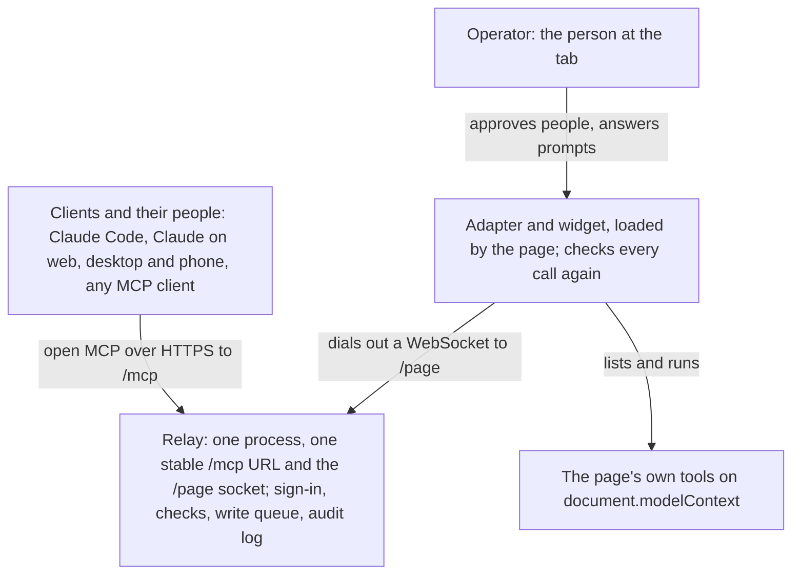

# Tabdock

Tabdock lets MCP clients use the tools of a live web page. The page registers tools through WebMCP, and a small adapter on it dials out to a relay: a remote MCP server with one stable URL that Claude Code, Claude on the web, desktop and phone, or any MCP client adds once. Several people and clients can attach to one page, and the person at the tab approves each, unless the page admits members as observers by policy or that person has minted a Can watch invite, which admits guests as observers in advance.

## Why it is different

A page's tools run inside the tab, with the user's own signed-in session and live state, so an agent can work an app that has no API, and your back end gains no endpoint or credential. The tab dials out to one relay URL, so the browser opens no port and the connector never changes as pages come and go. Several people and their clients share a page with roles: observers call only read-only tools, drivers call the rest, and writes run one at a time. Consequential calls wait for a human, on the page or, where the page allows it, in the calling member's own client. [Use cases](docs/guide/09-use-cases.md) shows what that makes possible; [the comparison with MCP-B's local relay](docs/mcp-b-comparison.md) shows where a simpler tool fits better.

## How it works



The relay never runs a tool: it signs clients in and checks and routes each call, and the adapter checks it again before the page's handler runs. It sees calls in plain text, so you run your own. Page origins are allowlisted, tokens and codes never reach a log, and every call is audited; [Security](docs/guide/10-security.md) has the rest. [Concepts](docs/guide/01-concepts.md) explains the parts, the flows and the three dials of roles, consequence and reach.

## Status

Version 0.1.0 is prepared but not yet on npm, so today Tabdock runs from a clone; `npx @tabdock/relay` and `npm install @tabdock/adapter` work once 0.1.0 is on npm. Every security requirement in `SPEC.md` section 9 has automated tests. What has been checked, and where:

| Path                                                | Checked in the sandbox                                                                                      | Waiting for the owner's own devices                                           |
| --------------------------------------------------- | ----------------------------------------------------------------------------------------------------------- | ----------------------------------------------------------------------------- |
| Claude Code in local mode                           | Claude Code 2.1.289 headless, on MCP 2026-07-28 and 2025-11-25, first-class tools included                  | The header helper on macOS and Windows; the confirmation dialog with a person |
| Other MCP clients                                   | The SDK client matrix and the official conformance suite in CI; confirmation in the client with SDK clients | Nothing                                                                       |
| The adapter in a browser                            | Headless Chromium with the MCP-B polyfill 5.1.0 and the 6.0 beta                                            | An hour in a background tab, Energy Saver and laptop sleep                    |
| Claude on web, desktop and phone; QR scans; invites | Public URL mode against a stand-in identity provider, in a phone-sized browser                              | All of it: none has run live yet                                              |
| The container image                                 | Built and smoke-tested                                                                                      | A real host                                                                   |

The open steps are in `docs/checklists/` (M3, M4 and M5). WebMCP is an early draft in a Chrome origin trial, so the demo board uses the MCP-B polyfill.

## Quick start

You need Node 22.18 or later, pnpm 10 and Claude Code or another MCP client.

```sh
git clone https://github.com/PaulMRamirez/tabdock.git
cd tabdock
pnpm install
pnpm dev
```

With no auth settings (in the environment or `.env`) and outside production, the relay runs in local mode: loopback only, one user, and an owner token in a private file outside the checkout. On macOS and Linux `pnpm dev` prints a `claude mcp add-json` line whose header helper reads that token whenever Claude Code connects, so neither the command nor Claude Code's settings hold it. Paste it and check with `claude mcp list` (never `claude mcp get`, which prints stored headers). Open the board link it printed, click Connect, ask Claude to pair with the code in the widget, and click Allow as driver. [Quick start](docs/guide/02-quick-start.md) has the details.

## Your own page

```ts
import { attach } from '@tabdock/adapter';

const notes: string[] = [];

// A WebMCP runtime must already be installed: Chrome's own, or the MCP-B polyfill.
await document.modelContext?.registerTool({
  name: 'add_note',
  title: 'Add note',
  description: 'Add a note to the page and return how many there are.',
  inputSchema: { type: 'object', properties: { text: { type: 'string' } }, required: ['text'] },
  annotations: { readOnlyHint: false },
  execute: async (input) => {
    const text = (input as { text?: unknown } | null)?.text;
    if (typeof text !== 'string') return 'text must be a string';
    return { count: notes.push(text) };
  },
});
await document.modelContext?.registerTool({
  name: 'clear_notes',
  title: 'Clear notes',
  description: 'Remove every note. This cannot be undone.',
  inputSchema: { type: 'object', properties: {} },
  annotations: { readOnlyHint: false, consequentialHint: true },
  execute: async () => ({ removed: notes.splice(0).length }),
});

// The only control handle: keep it private.
const dock = attach({
  relay: 'ws://127.0.0.1:8787/page',
  policy: { consequentialTools: ['clear_notes'] },
});
```

That URL serves a page on the relay's own machine, and by default the relay admits http and https pages on `localhost`, `127.0.0.1` and `[::1]`; only hosted mode takes `wss://<host>/page` from pages elsewhere, on origins it lists. A tool prompts the operator when its `consequentialHint` is true or `policy.consequentialTools` names it. Set both: MCP-B 5.x and Chrome 153 drop the hint, and there a page whose list names no tool has every tool that is not read-only prompt (ADRs 0002 and 0034). A page that wants no prompts says `consequential: 'allow'`. Until 0.1.0 is on npm, take the adapter from a clone: `pnpm release:pack` packs installable tarballs into `dist/packages`, and `pnpm --filter @tabdock/adapter build` writes the script-tag file. [Add to your app](docs/guide/03-add-to-your-app.md) has the rest.

## Claude on the web, desktop and phone

Hosted Claude reaches a connector from the cloud, so a relay on loopback cannot serve it. Public URL mode puts the relay behind a tunnel with a fixed https name and signs people in through an OAuth provider that meets `SPEC.md` section 7, plus a confidential client for the QR page at `/pair`; `pnpm dev:public` names the six settings. Pages then still attach only from the relay's machine; hosted mode, behind a host edge, takes them from anywhere on listed origins. In Claude, add `https://<relay>/mcp` under Customize, Connectors, +, Add custom connector and sign in; Claude Code uses `claude mcp add --transport http --scope user tabdock https://<relay>/mcp`, then `claude mcp login tabdock`. See [Connect clients](docs/guide/05-connect-clients.md) and [Run a relay](docs/guide/07-run-a-relay.md).

## Docs

[The guide](docs/guide/README.md) is for people using Tabdock, with a reading order for each audience:

| You want to                        | Read                                                                                                                                                |
| ---------------------------------- | --------------------------------------------------------------------------------------------------------------------------------------------------- |
| Understand it                      | [Concepts](docs/guide/01-concepts.md), [Use cases](docs/guide/09-use-cases.md)                                                                      |
| Try it                             | [Quick start](docs/guide/02-quick-start.md)                                                                                                         |
| Add it to a web app                | [Add to your app](docs/guide/03-add-to-your-app.md), [Adapter reference](docs/guide/04-adapter-reference.md), [Security](docs/guide/10-security.md) |
| Use a page from Claude or a client | [Connect clients](docs/guide/05-connect-clients.md), [Troubleshooting](docs/guide/11-troubleshooting.md)                                            |
| Share a page you run               | [Sharing](docs/guide/06-sharing.md)                                                                                                                 |
| Run a relay                        | [Run a relay](docs/guide/07-run-a-relay.md), [Relay settings](docs/guide/08-relay-settings.md)                                                      |

For contributors: `docs/develop.md` (every command), `SPEC.md` (the source of truth), `docs/adr/` (the decisions), `docs/threat-model.md` (each boundary and its tests), `docs/mcp-b-comparison.md`, `docs/tour/` (the build's history, a milestone a page), `docs/deploy.md` (the reference deployment), `docs/release.md`, `CHANGELOG.md`, `.env.example` (every setting), and the READMEs of `packages/adapter`, `packages/relay`, `packages/protocol` and `apps/demo`. `pnpm site:build` builds the demo board and the tour into a static site for GitHub Pages, not yet published; until it is, run the board with `pnpm dev`.

## Licence

Apache-2.0; see [LICENSE](LICENSE) and [NOTICE](NOTICE).
