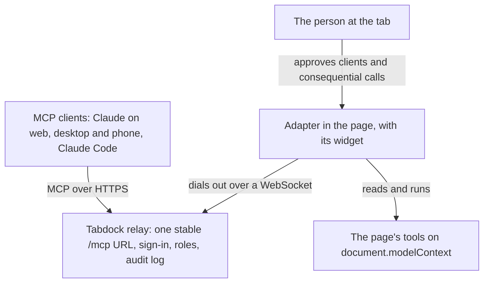

# Tabdock

Tabdock lets MCP clients use the tools of a live web page. The page registers its tools through WebMCP and a small adapter dials out to a relay, a remote MCP server with one stable URL that Claude on any device, Claude Code or any other MCP client adds once. Several clients and several people can attach to one page, and the person at the tab approves each of them.

## Try it

The tour and the demo board are linked from this repository's About section (its website field). The tour explains each milestone in a few minutes of reading; the board is a small canvas with six tools, and it dials a relay only after you name one and click Connect.

## Local mode with Claude Code

You need Node 22.18 or later and pnpm 10.

```sh
pnpm install
pnpm dev
```

With no `.env`, the relay runs in local mode: loopback only, one user, and an owner token kept in a private file outside the repository. Without a clone, `npx @tabdock/relay` starts the same relay. Paste the command the relay prints into a terminal: on macOS and Linux a `claude mcp add-json` line whose header helper reads the token as Claude Code connects, so the token never enters the command or Claude Code's settings. Then check it with `claude mcp list` (never `claude mcp get`, which prints a stored header). Open the board link `pnpm dev` printed, click Connect, ask Claude to pair with the code in the board's widget, and approve the request on the page. A relay started with `npx` prints no board link: attach your own page (below), or start it with the published board's origin in `TABDOCK_ALLOWED_ORIGINS` and allow Chrome's local network prompt there.

## Claude on the web, desktop and phone

Claude in the browser and on the phone connects from Anthropic's cloud, so it needs the relay at a public https URL: through a tunnel with `pnpm dev:public`, or on a host as `docs/deploy.md` describes. Add `https://<relay>/mcp` under Customize, Connectors, Add, Add custom connector (Free plans allow one) and sign in. Claude Code reaches a hosted relay with `claude mcp add --transport http --scope user tabdock https://<relay>/mcp`, then `/mcp` or `claude mcp login tabdock` to sign in. A phone can also join a page by scanning the widget's QR code.

## Your own page

Register tools on `document.modelContext` (natively or through the MCP-B polyfill), then attach:

```ts
import { attach } from '@tabdock/adapter';
const dock = attach({
  relay: 'wss://relay.example/page',
  policy: {
    autoApprove: 'none',
    maxDrivers: 1,
    consequential: 'confirm',
    confirmVia: 'page',
    consequentialTools: [],
    invites: 'watch',
  },
});
```

## Security in brief

The person at the tab approves every attachment, or mints the invite that admits one. Roles are checked in the relay and again in the page, and consequential tools prompt on the page unless the page opts in to confirmation in a member's own client. The relay sees calls in plain text, so run your own. Page origins are allowlisted, tokens and codes never reach a log, and every call is audited. `docs/threat-model.md` maps each boundary to its tests.

## Architecture



## Docs

- `docs/tour/`: one short explainer per milestone, also published with the demo.
- `docs/develop.md`: every command, from tests to the milestone demos and the site build.
- `docs/deploy.md`: local mode, public URL mode and the reference deployment.
- `docs/threat-model.md`, `SPEC.md` (the source of truth) and `docs/adr/` (the decisions).

## Status and licence

Release 0.1.0: the relay, the adapter and their protocol, checked automatically against every security requirement in `SPEC.md` section 9, with what needs a person's own device in `docs/checklists/`. WebMCP is still an early draft behind a Chrome origin trial, so the demo uses the MCP-B polyfill. Licensed under Apache-2.0; see `LICENSE` and `NOTICE`.
