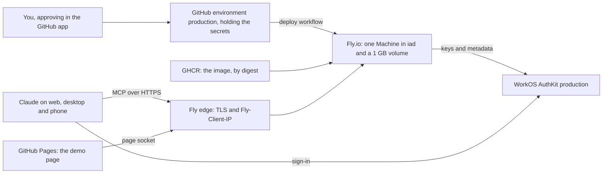

# Deploying Tabdock

Tabdock runs on any host that meets SPEC section 11, with any identity provider that meets section 7; the hosted setup in this guide is one worked example. The simplest start needs neither. With no settings, `pnpm relay` runs **local mode** (ADR 0022): the relay listens on loopback only, keeps a 256-bit owner token in a private file outside the repository, and prints a `claude mcp add` command that reads it. Claude Code and any other MCP client on the same computer can use it straight away, with no account, tunnel or host.

Claude on the web, desktop and phone connects from Anthropic's cloud, so it reaches only a relay in **public URL mode**, by one of two routes. A tunnel in front of a relay on your own machine is the quick one: `pnpm dev:public` runs that mode with the demo board, as the M3 spike did with ngrok (ADR 0014). A host is the lasting one (ADR 0018). Tabdock names no tunnel, host or provider, and every setting is an environment variable.

Everything after the next two sections is one worked example, the project's **reference deployment**: Fly.io as the host, a WorkOS AuthKit production environment as the provider, a DNS-only `relay.<domain>` on the owner's personal domain, deploys by manual dispatch from GitHub Actions, and the demo page on GitHub Pages at `demo.<domain>`. Steps that belong to one platform are marked **Fly**, **WorkOS** or **GitHub**, so running on another host means a new section here, not a code change. `docs/checklists/M4.md` holds the same setup as a click list; (C) marks a step that needs a computer.

## Local mode

From a clone, `pnpm install` and then `pnpm relay` (or `pnpm dev`, which adds the demo board). If a `.env` exists its settings win, so move it aside first. The first start creates `owner-token` in a directory only you can read: `TABDOCK_HOME` when set (an absolute path), otherwise `$XDG_CONFIG_HOME/tabdock` or `~/.config/tabdock` on Linux, `~/Library/Application Support/Tabdock` on macOS and `%LOCALAPPDATA%\Tabdock` on Windows. The directory is 0700 and the file 0600 where POSIX modes apply. Paste the command the banner prints, then check with `claude mcp list`; never with `claude mcp get`, which prints the stored header in full. A refusal at start names its fix (`chmod 600`, `chmod 700`, or delete the file and start again) and never the file's contents.

To rotate the token, stop the relay, delete the file, start again, run `claude mcp remove tabdock-local --scope user` and paste the new command; the old token then gets 401. Local mode trusts every account on its computer: another account could take the port while the relay is down, and Claude Code keeps its own copy of the token in `~/.claude.json`. On a machine shared with accounts you do not trust, use a host with sign-in instead. Its audit log lives in `audit/` beside the token.

## What a host and a provider must do

A host qualifies when it does each of the following (SPEC section 11, ADRs 0018 and 0019); after each, how Fly meets it in the reference deployment.

**TLS and pass-through.** It terminates TLS for the public URL and passes requests and WebSocket upgrades through with the original `Host`. On Fly: Fly's proxy, through `[http_service]`.

**Slow and streamed answers.** It lets a request wait at least 60 s for its first byte and streams responses unbuffered. On Fly: no request time cap is documented, only an idle timer.

**One trusted address header.** Its proxy sets one client-address header, replacing any value a client sent, from a range nothing else can reach the port from. On Fly: `Fly-Client-IP`, which replaced a forged value in a live probe; the range is narrowed after the first deploy.

**One instance with a disk.** It runs exactly one instance, stopping the old before starting the new, with a persistent directory for the audit log. On Fly: one Machine with a volume, which makes Fly refuse the `bluegreen` and `canary` strategies.

**Long connections.** It keeps open a connection that carries a ping every 15 s. On Fly: the relay's pings beat the idle timer.

**Public IPv4.** It gives the hostname a public IPv4 `A` record, as Claude requires. On Fly: a shared IPv4 address, free.

A provider qualifies (SPEC section 7, ADRs 0013 and 0020) when its metadata names its issuer, S256 PKCE, and client ID metadata documents or dynamic registration; when it issues access tokens as RS256-signed JWTs, never opaque ones, whose keys sit at its `jwks_uri`, whose `aud` is the relay's MCP URL from the `resource` parameter, with a stable `sub`, `iat`, `jti`, an `exp` within the relay's cap (2 hours by default) and, if you set `TABDOCK_OAUTH_CLIENT_IDS`, RFC 9068's `client_id`; and when it offers a confidential client for `/pair` and `/i` whose signed ID token carries the same `sub`. Email claims are optional: without them guests show as unverified accounts. WorkOS meets this through the switches and template below.

## The reference deployment at a glance



It costs about $3.84 a month on Fly ($3.69 for a `shared-cpu-1x` Machine with 512 MB running all month in `iad`, $0.15 for the 1 GB volume), plus outbound data at $0.02 per GB in North America and Europe. Daily volume snapshots fit in the free 10 GB, and shared IPv4, IPv6 and the first ten certificates are free. WorkOS production is $0 with a card on file, GHCR, Actions and Pages are free for a public repository, and the domain is whatever you already pay for it.

## Accounts

Create the GitHub `production` environment first (its protections are under GitHub below), so that each value goes into it the moment a page shows it, two of them only once; then Fly, WorkOS and Pages.

### Fly.io (Fly)

Fly has no free tier: a trial lasts 2 Machine hours or 7 days, after which the organization needs a card on its Billing page, or at least $25 of prepaid credit. Most of the rest needs flyctl (C): install it with `brew install flyctl` or `curl -L https://fly.io/install.sh | sh` (on Windows, `pwsh -Command "iwr https://fly.io/install.ps1 -useb | iex"`) and sign in with `fly auth login`.

**The app.** `fly apps create <app> --org personal`. App names are unique across Fly and public: the app also answers at `<app>.fly.dev`, where the relay's Host check gives 403 to everything but `/healthz`. `deploy/fly/fly.toml` names no app; the deploy workflow passes the name to flyctl through `FLY_APP`, a secret, and GitHub hides a secret's value wherever a log prints it, so pick a name the deploy log would not print anyway (not plain `tabdock`, which would also hide `tabdock_audit`). If the `personal` organization holds or will hold other apps, create an organization for Tabdock alone and use it instead, since the deploy token below reaches its organization's private network; each organization needs its own card.

**The volume.** `fly volumes create tabdock_audit --app <app> --region iad --size 1`. It holds only the audit log (ADR 0019). Its name must match the `[mounts]` source in `fly.toml`; with a different name, `fly deploy` would create a fresh volume and leave this one unused (and still billed). Volumes are encrypted at rest, snapshotted daily and the snapshots kept 5 days by default (1 to 60 can be set). Fly recommends two volumes per app, because one sits on one server; the relay keeps its state in memory and must run as exactly one instance, so one volume and a short outage on each deploy or host failure is the accepted trade.

**Addresses.** A first deploy gives the app a dedicated IPv6 and a shared IPv4 address. Since that deploy waits for the M4 merge, allocate them by hand so DNS and the certificate can go first: `fly ips allocate-v6 --app <app>` and `fly ips allocate-v4 --shared --app <app>`. Leaving out `--shared` buys a dedicated IPv4 for $2 a month, which the relay does not need.

**The certificate.** In the dashboard, the app's Certificates page, add `relay.<domain>` (or `fly certs add relay.<domain> --app <app>`). Fly then shows several alternative DNS setups, not one list to copy. This one uses the `A` and `AAAA` records for the two addresses and the `_acme-challenge` CNAME, which lets Fly issue the certificate before anything runs (`fly certs setup` shows every option). Skip the alternative CNAME for `relay` itself, which DNS does not allow beside the `A` and `AAAA` records, and the `_fly-ownership` TXT record, which only setups without these need. Fly validates through the `AAAA` record or that CNAME and renews on its own.

**The deploy token.** In the dashboard, the app's Tokens page, create a token named `github-production`, or run `fly tokens create deploy --app <app> --name github-production --expiry 8760h`. It is app-scoped, but not to the app alone: it can manage this app, and since Fly counts WireGuard tunnels as part of deploying, it can also open one into the organization's private network, which reaches every other app there. Its default lifetime is 20 years, so give it about one and note the date. Copy all of it, including the leading `FlyV1` and the space after it, straight into the environment secret `FLY_API_TOKEN`. Fly's own documentation warns that anyone who can deploy can ship code that reads the app's secrets, so this token is as sensitive as every other setting together; that is why it lives behind the environment's required reviewer.

### WorkOS AuthKit production (WorkOS)

Staging and production share nothing: issuer, keys, applications, redirect URIs and users are separate, so moving changes every `sub` and the M3 values do not carry over (ADR 0020). Production stays locked until a payment method is on the workspace's Billing page. AuthKit is free below a million monthly active users while no SSO connection, custom domain or Radar is in use; the sign-in page then lives on the environment's random `*.authkit.app` name.

**Sign-in.** Email + Password is on by default. Magic Auth, a six-digit code by email that lasts 10 minutes, is off until you enable it under Authentication. Email verification is always on for hosted sign-up. Sign up stays open (it is a toggle under Authentication): the relay's allowlist and invites are the gate, and closing sign-up would mean sending a WorkOS invitation to every guest. WorkOS's shared Google and GitHub sign-in credentials work only in staging; your own Google app can come later without changing any `sub`.

**MCP clients.** Under Connect, Configuration, turn on Client ID Metadata Document and Dynamic Client Registration. Hosted Claude and Claude Code use client ID metadata documents when the provider offers them; registration stays on for clients that do not, until the record shows it is unused. Add `https://relay.<domain>/mcp` as a resource indicator and Set as default: tokens then carry it as `aud`, also for clients that send no `resource`. The default applies only to clients that register themselves, which is how MCP clients arrive.

**The JWT template.** Under Authentication, Features, JWT Template:

```
{ "urn:tabdock:email": {{ user.email }}, "urn:tabdock:email_verified": {{ user.email_verified }} }
```

One template per environment renders into every access token from a sign-in or consent, including those for registered MCP clients. Namespaced keys keep clear of the reserved ones (`iss`, `sub`, `exp`, `iat`, `nbf`, `jti`), a null value drops its key, and the output may be at most 3,072 bytes. No WorkOS example shows how a bare boolean renders, so the relay logs the claim types (never values) from the first production token. A missing or mistyped claim shows a guest as an unverified account; identity is always `sub`.

**The `/pair` client.** Under Connect, Applications, an OAuth application, first-party and confidential (not Public), with the redirect URI `https://relay.<domain>/pair/callback`; production accepts only https redirect URIs, apart from `http://127.0.0.1`. The relay signs a phone's browser in through it at `/pair` and `/i`, asking for `openid email`. An application holds up to five secrets, each shown once and never expiring, which is what makes rotation painless.

**The issuer and your user ID.** The issuer is the `issuer` field at `https://<authkit domain>/.well-known/oauth-authorization-server`, copied exactly. Your user ID (`user_...`) appears on your page under Users once you have signed up; the checklist signs you up through the `/pair` client's authorize address, before the relay exists, so the ID is ready for the first deploy. Every member does the same once.

### GitHub (GitHub)

**The `production` environment.** Required reviewers, with you as the only one; Prevent self-review off, or nobody could approve a deploy you start; Allow administrators to bypass configured protection rules off, so even a run under your own account waits for Approve; and deployment branches limited to `main`. A job that references the environment cannot read its secrets until a reviewer approves it. On the free plan all of this needs a public repository.

**Protecting `main`.** The branch rule is only as strong as `main`, which also holds the deploy workflow. A branch ruleset on the default branch, active, with an empty bypass list, keeps Restrict deletions and Block force pushes and adds Require a pull request before merging, with no approvals required, since nobody else could approve your own pull requests. It does not stop someone acting as you from opening and merging a pull request, so the approval is the real gate: approve only a run on `main` that you started or were told about, whose commit is a merge you reviewed, reject any other, and never ask a session to approve for you.

**Dispatch.** GitHub runs a `workflow_dispatch` workflow only when its file is on the default branch, so the first deploy waits for the M4 merge; the branch rule then refuses a dispatch from any other branch.

**The image.** CI publishes to GHCR with the workflow's own token. A first publish is private, and since Fly pulls anonymously, you make the package public once, under its Package settings.

**Pages.** The demo is a static site, published by a workflow at `demo.<domain>`. A custom domain that points at Pages without being claimed can be taken over, so the order is fixed (ADR 0021): verify `<domain>` in your profile's Pages settings (a TXT record named `_github-pages-challenge-<user>`, kept for good, which also protects every immediate subdomain); set the repository's Pages source to GitHub Actions and its custom domain to `demo.<domain>`; only then create the CNAME; and tick Enforce HTTPS once offered, which GitHub says can take up to 24 hours. No wildcard record may exist in the zone, since GitHub warns it allows a takeover even of a verified domain. To retire the demo, remove its origin from `TABDOCK_ALLOWED_ORIGINS` and deploy, then delete the CNAME, then the Pages site.

### DNS

The zone ends up with `A` and `AAAA` records for `relay`, the `_acme-challenge.relay` CNAME Fly names, a CNAME from `demo` to `<user>.github.io`, the Pages verification TXT record, and no wildcard. Every record is DNS only: a proxy in front of Fly would put its own address in `Fly-Client-IP`, hold WebSockets and see the plaintext. Claude refuses a connector hostname whose answers are private, loopback, mixed public and private, or IPv6 only, so the `A` record is required. If the zone has CAA records, they must allow `letsencrypt.org`, which issues both Fly's and GitHub's certificates. A hostname of your own is the point of all this: a connector cannot be edited, so a later host move should change only DNS.

## Settings

### Where they live

Every setting that names your domain, accounts or credentials is a secret of the GitHub `production` environment, and nowhere else you maintain. Not in the repository, which is public. Not as an environment variable, which GitHub prints unmasked in logs. Not as a repository secret, which any workflow could read without your approval. GitHub redacts secrets printed to logs, though not reliably once a value is transformed, so the workflows never print them. Redaction also cuts the other way: GitHub hides every occurrence of a secret's value in a job's log, with no minimum length, so a setting that names nothing of yours stays out of the secrets (a secret of `1` would turn every `1` in the deploy log, digests and Machine IDs included, into `***`).

After your approval, the deploy workflow (workstream C) copies the relay's settings into Fly's secret store, which encrypts them, never logs them, and hands them to the Machine as environment variables at boot. flyctl can stage them from standard input with `fly secrets import --stage`, so no value appears on a command line, and the deploy that follows applies them. Fly's store keeps its own copy: deleting a secret at GitHub leaves it at Fly until the workflow or `fly secrets unset` (C) removes it. `FLY_API_TOKEN` and `FLY_APP` stay on the runner and never reach the relay.

A changed setting takes effect only with a deploy, and every deploy restarts the relay: pages reconnect as new sessions, everyone pairs again and live invite links die, while Claude stays signed in (ADR 0019). Batch changes where you can.

### Each secret

**`FLY_API_TOKEN`**, for flyctl in the deploy job. It comes from the app's Tokens page, `FlyV1` prefix included. To rotate, create a new token, replace the secret, dispatch a deploy to prove it works, then revoke the old token on the Tokens page (or `fly tokens list --app <app>` and `fly tokens revoke <id>`, (C)). If it leaks, revoke it first; since it could have deployed code that reads every secret, rotate the `/pair` secret too. When it expires, deploys fail to authenticate and the running Machine carries on.

**`FLY_APP`**, the app's name, which flyctl reads from this variable so `fly.toml` names none. It is public anyway as `<app>.fly.dev`; it is a secret only so the repository names no app. It does not rotate: moving to a new app means a new volume (the old one keeps the audit history), new addresses, a new certificate and new DNS records, while the connector URL stays as it was.

**`TABDOCK_PUBLIC_URL`**, the relay's public origin, `https://relay.<domain>`, with no path. The connector URL is this plus `/mcp`; it is also the `resource` in the relay's protected resource metadata and so the audience every token must carry, the base of `/pair` and `/i` links and of the page socket `wss://relay.<domain>/page`, and its host joins the Host allowlist. Treat it as permanent: a connector cannot be edited, so a new URL means every member and guest removes and re-adds theirs, plus a new resource indicator, redirect URI and certificate.

**`TABDOCK_OAUTH_ISSUER`**, the provider's issuer, copied from its metadata. The relay checks the metadata at start (S256, and client ID metadata documents or registration) and again hourly, refusing a changed issuer or key URL. It changes only when you move to another provider or environment, which also changes every `sub`, the `/pair` client and every connector (ADR 0020). WorkOS rotating its signing keys is a different event, covered by the key rotation runbook below.

**`TABDOCK_OAUTH_USERS`**, the members: comma-separated `sub=userId:Display Name` entries, where `sub` is the WorkOS user ID, `userId` is 1 to 64 letters, digits, `_` or `-` and never starts with `g_`, and the name is optional and has no comma. Only members pair by code and sponsor invites. To add someone, they sign up once and you add their ID and deploy. To remove someone, delete their entry and deploy; with invites on they become an invitee, who sees only pages they hold by invite, and the restart ends their attachments. A person who deletes their WorkOS account and signs up again gets a new `sub`.

**`TABDOCK_PAIR_CLIENT_ID`** and **`TABDOCK_PAIR_CLIENT_SECRET`**, the relay's own confidential client, from Connect, Applications. The relay sends the secret to WorkOS on each code exchange at `/pair/callback`, which it bounds to 60 a minute and 8 at once for the whole relay and 10 a minute and 2 at once per address. To rotate the secret, create a second one on the same application, replace the GitHub secret, deploy, then delete the old one at WorkOS; if it leaked, delete the old one at once and accept that QR sign-in fails until the deploy. The client ID changes only if you recreate the application.

**`TABDOCK_ALLOWED_ORIGINS`**, the page origins that may open the page socket (S2): `https://demo.<domain>`, plus any other origin whose pages run the adapter against this relay. Production refuses to start without it. Retire an origin by removing it here and deploying before its DNS record or site goes.

### Settings in the repository

Settings that are the same for anyone deploying this way and name nothing of yours live in `deploy/fly/fly.toml` (ADR 0018), where each change is a pull request you review: `TABDOCK_ENV=production`, `TABDOCK_HOST=0.0.0.0`, the port, `TABDOCK_AUDIT_DIR` on the volume's mount, and the three below. Workstream C writes the file; these are the values it will hold. See the `fly.toml` section below.

**`TABDOCK_INVITES`**, set to `1` to turn invites on (ADRs 0016 and 0017): a signed-in account off the allowlist becomes an invitee instead of getting 403, and members can mint watch invites in the widget, and control invites only on pages that allow them (`policy.invites: 'all'`; the default is `watch`). Delete the line in a pull request and deploy to turn invites off again.

**`TABDOCK_CLIENT_ADDRESS_HEADER`**, the one header the host's proxy overwrites with the client's address: `fly-client-ip` on Fly, the same for every Fly deployment. With production and a public URL it is what makes hosted mode, the only mode that may bind `0.0.0.0`. It must never name `X-Forwarded-For`, to which Fly appends, or `X-Real-IP`, which Fly passed through unchanged in the probe. A request whose header is missing, repeated or not an address gets 400 on the routes that count by address (`/page`, `/pair`, `/i`). It changes only with the host.

**`TABDOCK_TRUSTED_PROXY_CIDR`**, the TCP peers whose header is believed, as a comma-separated list of ranges. It is not set at first, so the relay's default, the RFC 1918 ranges, applies, because Fly documents no range for its proxy. After the first deploy the relay logs the first proxy address it sees and every untrusted peer; a pull request then sets it to the smallest range holding the proxy's address, and you deploy again. The range describes Fly's proxy, not you. If untrusted-peer lines appear later, Fly has changed its addressing, and the setting follows.

### Optional, later

**`TABDOCK_OAUTH_CLIENT_IDS`** names the OAuth clients whose tokens the relay accepts and refuses others with 401. Set it once the first run shows hosted Claude and Claude Code signing in through client ID metadata documents, to the URLs seen (in `fly.toml`, since they name nothing of yours), and turn Dynamic Client Registration off at WorkOS in the same step; until then a client anyone registers could ask a member for consent (ADR 0020). **`TABDOCK_OAUTH_MAX_TOKEN_AGE`** is the token lifetime cap in minutes, 120 by default and refused above 1440; raise it only if the first production token shows a longer lifetime, and record why in ADR 0020. The hosted limits (100 page sessions, 5 page sockets and 5 page sessions per address, `TABDOCK_MAX_REQUESTS_PER_USER` at 240 a minute, `TABDOCK_MAX_REQUESTS_PER_INVITEE` at 60, and `TABDOCK_MAX_TOOL_BYTES`) suit a 512 MB Machine; raise them only with a larger one.

### Never in production

`TABDOCK_DEV_TOKENS` (ignored with a public URL, where only OAuth tokens work), `TABDOCK_SPIKE` (production refuses to start with it), `TABDOCK_DEV_ALLOW_NO_ORIGIN`, and anything from local mode.

## The image

_Placeholder, filled by workstream C with the code:_ the Dockerfile at the root, its build and runtime bases pinned by digest, what CI builds, scans, smoke-tests and attests, and how to check an image with `gh attestation verify`.

## The workflows

_Placeholder, filled by workstream C:_ the CI image job and the dispatch-only deploy workflow (its inputs, the `production` environment, how it stages the secrets above and deploys one image digest), and the Pages workflow for the demo.

## `deploy/fly/fly.toml`

_Placeholder, filled by workstream C:_ each section of the file, the `[http_service]` handler that rewrites `Fly-Client-IP` and the CI check that keeps it, the `tabdock_audit` mount, `auto_stop_machines = "off"`, the deploy strategy that stops the old Machine before starting the new, and the fixed settings.

## First deploy

_Placeholder, filled by workstream C after the merge:_ dispatching and approving the first deploy, the checks that follow (`/healthz`, the 401 challenge naming the metadata URL, the metadata naming the issuer), narrowing `TABDOCK_TRUSTED_PROXY_CIDR`, and adding the connector.

## Rollback

_Placeholder, filled by workstream C:_ redeploying the previous digest (never `latest`), what a rollback costs (a restart, so everyone pairs again), and undoing WorkOS changes by hand.

## Key rotation runbook

_Placeholder, filled by workstream C:_ what happens when WorkOS rotates its signing keys (up to about 330 s of 401s, ADR 0020), and the order for rotating every secret above at once after a suspected leak.

## Volume ownership fallback

_Placeholder, filled by workstream C:_ the image runs as uid 65532 and production refuses to start if it cannot write the audit directory; if the first deploy shows Fly did not hand the volume to that user, the one-time `chown` that fixes it.

## Reading the audit log

_Placeholder, filled by workstream C:_ `pnpm audit:log` and its filters, `--verify` for the hash chain, running it inside the Machine with `fly ssh console -C` or on files copied out with `fly ssh sftp get`, and what the platform's 7-day logs hold beside it.
