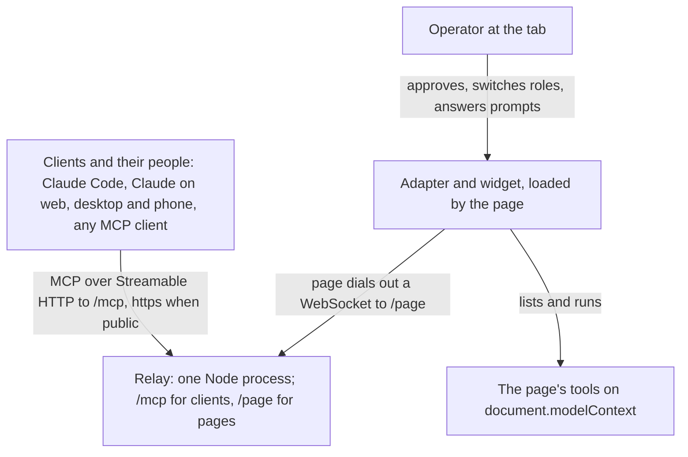
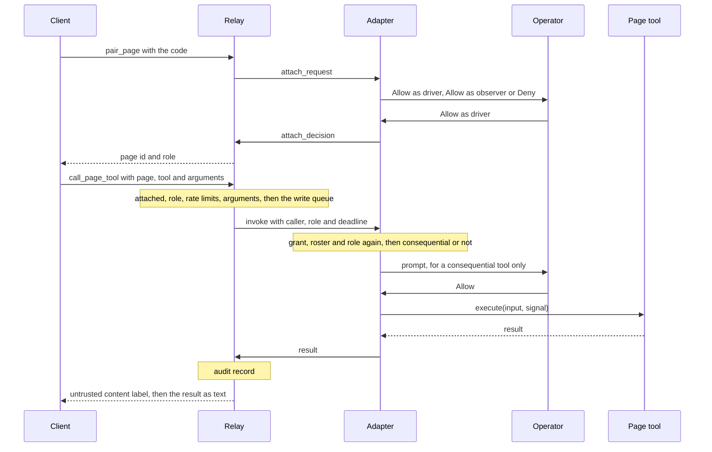
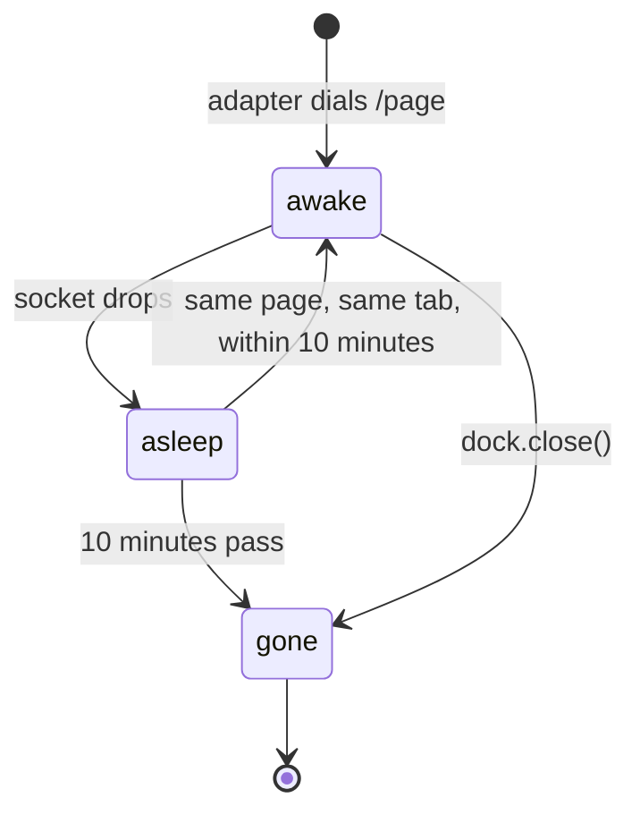

# Concepts

Tabdock turns a live browser tab into an MCP server that dials out. The page registers tools through WebMCP, an adapter in it opens a WebSocket to a relay, and the relay is a remote MCP server with one stable URL that any MCP client adds once; the person at the tab decides who gets in and confirms what matters. The model has five parts, four flows and three dials.

## The five parts

Clients and pages both dial the relay; nothing dials the browser.

The **page** is any web app that registers tools on `document.modelContext`, through Chrome's own WebMCP or the MCP-B polyfill. Each handler runs only inside the tab, with its state and the user's signed-in session.

The **operator** is whoever sits at that tab, the root of trust: nobody attaches without the operator's approval or the page's policy, and the operator can switch roles, revoke, pause or mint invites at any moment.

The **adapter** (`@tabdock/adapter`) is a script the page loads. It reads the tools, dials the relay, checks every call again against its own record of grants and the page's policy, and draws the **widget**: a badge and panel with the pairing code and QR code, the roster, prompts, recent calls, Pause and invites. Only the code that called `attach()` holds the control handle; the script-tag build has none, leaving the widget as the only control.

The **relay** (`@tabdock/relay`) is one Node process with two doors: `/mcp`, the Streamable HTTP URL clients add, and `/page`, the socket pages dial. It signs clients in, holds pages, attachments, codes and invites in memory, checks and routes calls, queues writes, labels results and keeps the audit log. It never runs a tool, but it sees calls and results in plain text, as does any tunnel or host edge that terminates TLS in front of it, so you run your own.

The **clients** are Claude Code, Claude on the web, desktop and phone, or any MCP client. Identity is the signed-in account, so one person's clients share that person's attachments. A **member** is an account the relay knows (local mode's user `you`, a dev token's user, or an entry in `TABDOCK_OAUTH_USERS`). With invites on (`TABDOCK_INVITES=1`), any other signed-in account is an **invitee**, which reaches a page only through an invite; with them off, the relay refuses it.

## Four flows

**Dial out.** The adapter connects to `/page`. The relay takes the page's origin from the browser's `Origin` header, never from page text, checks it against its allowlist, and answers with a page id such as `pg_0123456789` and a **pairing code** such as `ABCDE-12345`, which lives 120 s and works once. The page then sends its tool list, and again whenever it changes.

**Attach.** An **attachment** joins one account to one page with a role. A member's client calls `pair_page` with the code, or a phone scans the widget's QR code and signs in at `/pair` (public URL only), and the widget asks the operator to Allow as driver, Allow as observer or Deny within 60 s; silence is a denial. A guest redeems an **invite** link minted in the widget: Can watch admits observers in advance, Can control prompts like a code. A page with `autoApprove: 'observer'` admits members as observers with no click. Invitees offering a code get `invite_required`.

**Call.** Every relay offers five **fixed tools**: `list_pages`, `pair_page`, `list_page_tools`, `call_page_tool` and `detach_page`. With `TABDOCK_FIRST_CLASS_TOOLS=1`, a member's client also lists each attached page's tools as **first-class tools** named `<page id>__<tool>` (a driver all of them, an observer the read-only ones), which take the very path `call_page_tool` takes.

Writes run one at a time per page in arrival order, reads alongside, and the adapter runs each call under the least of its own grant, the relay's roster and the claimed role. The result reaches the client within 45 s of arrival, as text under a `[tabdock: untrusted content from <origin>, tool <name>]` line so the model treats it as data. Each call lands in the widget's activity log and the relay's **audit log**: hash-chained JSON Lines on disk in local mode or wherever `TABDOCK_AUDIT_DIR` points, otherwise only the relay's log output.

**Lifecycle.**

When the socket drops (a reload, a closed tab, a lost network) the page is asleep, and its attachments wait 10 minutes for it to resume in the same tab under the same id. The resume token and grants live in the tab's `sessionStorage`, keyed by relay URL, origin and path, so a fresh tab or another path is a new page needing its own approval. Attachments end after 8 hours unused, invite-made ones within 24 hours or with the page session. A relay restart forgets every page, attachment, code and invite (only the audit log on disk and local mode's token survive), and pages pair again under new ids.

## Three dials

**Roles.** An **observer** may call only tools whose `readOnlyHint` is true; every other tool is a write. A **driver** may call every tool. The operator picks the role at approval and can switch it later. `maxDrivers` (default 1) counts people, not clients, and a driver approved past it is seated as an observer. A page holds up to 10 people by default.

**Consequence.** A tool is **consequential** when its `consequentialHint` is true or the page names it in `policy.consequentialTools`. Name it in both: MCP-B 5.x and Chrome 153 drop the hint, and there a page whose list names no tool treats every write as consequential (a page whose tools carry no annotations at all gets no such fallback). The page's `consequential` policy then decides: `'confirm'` (the default) prompts the operator, `'allow'` runs the call, `'deny'` refuses it.

Under `'confirm'`, `confirmVia: 'client'` turns on **confirmation in the client**: a member driver whose attachment no invite made confirms in their own MCP client, where it declares form elicitation. A client's yes proves only that the account's client answered, perhaps with no person present.

| Caller                                                        | Read-only tool | Write                     | Consequential write                                        |
| ------------------------------------------------------------- | -------------- | ------------------------- | ---------------------------------------------------------- |
| Observer                                                      | Runs           | `role_denied`             | `role_denied`                                              |
| Driver, `'confirm'`                                           | Runs           | Runs, one write at a time | Prompts on the page; Deny or silence: `denied_by_operator` |
| Member driver, no invite, `confirmVia: 'client'`, elicitation | Runs           | Runs, one write at a time | Confirms in the client; anything but yes: `not_confirmed`  |
| Driver, `'allow'`                                             | Runs           | Runs, one write at a time | Runs with no prompt                                        |
| Driver, `'deny'`                                              | Runs           | Runs, one write at a time | `denied_by_operator`                                       |

While the operator has paused the page, every call that has not started, queued ones and those at a prompt included, answers `page_busy`; running ones finish.

**Reach.** **Local mode**, what the relay runs with no auth settings outside production, is loopback only, with one user holding an owner token kept outside the checkout; dev tokens (`TABDOCK_DEV_TOKENS`) replace that user with several named ones on the same machine, for testing. **Public URL mode** (`TABDOCK_PUBLIC_URL` with an OAuth provider) puts the relay behind a tunnel with sign-in, so Claude on the web, desktop and phone and the QR code work, and invites with `TABDOCK_INVITES=1`, while pages still attach only from the relay's machine. **Hosted mode** (`TABDOCK_ENV=production` with a public URL, behind a host edge that names the client in `TABDOCK_CLIENT_ADDRESS_HEADER`) also takes pages from anywhere on the origins `TABDOCK_ALLOWED_ORIGINS` lists. [Run a relay](07-run-a-relay.md) compares them.

## What makes it unusual

Most MCP servers wrap a server-side API; Tabdock wraps the page, so an agent works through the code a person clicks through, with the tab's session and state, and no credential leaves the browser. One stable URL suits Claude, whose connectors cannot be edited once added. Roles, a driver limit and a write queue let several people and agents share a page. Every check runs twice, so even a misbehaving relay cannot get past what the operator approved and the policy allows, nor skip the page's prompt unless the page chose confirmation in the client.

It is not browser automation: it calls only tools a page registers and never reads or clicks the page. Page ids, and first-class names built from them, change with a new tab or a restart, so never hard-code them. Nothing is encrypted end to end between client and page.

Next: [Quick start](02-quick-start.md). For what you can build, see [Use cases](09-use-cases.md); [the guide's index](README.md) lists every page.
