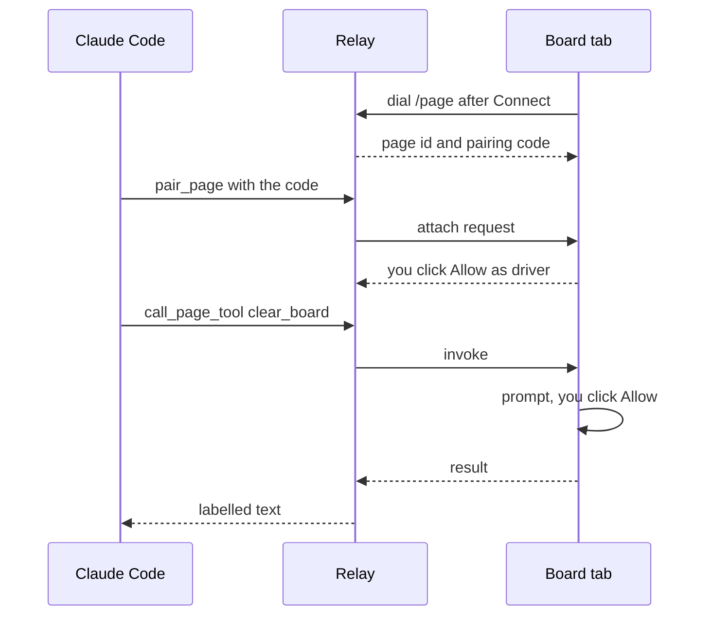

# Quick start

From a clone to Claude Code calling a tool on a live page in about ten minutes, then a page of your own, all on one computer in local mode. [Concepts](01-concepts.md) explains the parts first if you prefer, and [Connect clients](05-connect-clients.md) covers Claude on the web and the phone.

Tabdock 0.1.0 is prepared but not yet on npm, so today you start from a clone. Once 0.1.0 is on npm, `npx @tabdock/relay` starts the same relay without one.

## What you need

You need Node 22.18 or later, pnpm 10 (`corepack enable pnpm` gives you the version the repository names), git, a Chromium-based browser (the project tests in Chromium) and Claude Code, or another MCP client such as the short program in [Connect clients](05-connect-clients.md#any-mcp-client).

## Start the relay and the demo board

```sh
git clone https://github.com/PaulMRamirez/tabdock.git
cd tabdock
pnpm install
pnpm dev
```

`pnpm dev` starts the relay on `127.0.0.1:8787` and a demo board on `127.0.0.1:5173` and prints a banner; Ctrl-C stops both. With no auth settings in the environment or a `.env` file, the relay runs in local mode: loopback only, one user shown as You, and trust in every account on this computer. Its only credential is an owner token in a private file outside the repository: `~/.config/tabdock/owner-token` on Linux (or under `$XDG_CONFIG_HOME`), `~/Library/Application Support/Tabdock/owner-token` on macOS, `%LOCALAPPDATA%\Tabdock\owner-token` on Windows, or inside `TABDOCK_HOME` when you set it. The relay refuses a token directory inside a repository or under one another account can write, such as `/tmp`, and prints the token's path, never the token.

## Add the relay to Claude Code

On macOS and Linux the banner prints one line for Claude Code, naming your own token directory; for a user `you` on Linux it reads:

```sh
claude mcp add-json --scope user tabdock-local '{"type":"http","url":"http://127.0.0.1:8787/mcp","headersHelper":"/home/you/.config/tabdock/claude-headers"}'
```

Paste the line your banner prints. Claude Code runs the `claude-headers` helper beside the token at each connection, so neither the command nor Claude Code's settings hold the token. In PowerShell, or where the helper's path cannot be quoted, the banner prints a `claude mcp add ... --header` line instead, which leaves a copy of the token in Claude Code's settings. If Claude Code says `tabdock-local` already exists, run `claude mcp remove --scope user tabdock-local` and paste again. Then `claude mcp list` should show `tabdock-local` as Connected; avoid `claude mcp get`, which prints a stored header in full, the token included for a `--header` entry.

## Connect, pair and call

Open the board link from the banner, `http://127.0.0.1:5173/?relay=ws://127.0.0.1:8787/page`. The board dials nothing until you click its bar, Connect to 127.0.0.1:8787, which takes a click only once it has held still for half a second. The Tabdock widget then opens in the bottom right corner with a pairing code shaped like `ABCDE-12345`. A code lives 120 seconds and works once, and the widget shows a fresh one after each use.



Ask Claude Code to pair with the Tabdock page using the code. The widget asks "You wants to attach via code" with Allow as driver, Allow as observer and Deny; you have 60 seconds, and silence denies. Click Allow as driver. Then ask Claude to list the page's tools, add an item labelled Hello, and clear the board. `clear_board` is consequential, so the widget asks again ("You wants to run clear_board"). Click Deny once, and Claude reports `denied_by_operator`; ask again and click Allow. Each call appears in the widget's activity list, and every result Claude reads starts with a line such as `[tabdock: untrusted content from http://127.0.0.1:5173, tool add_item]`.

## A page of your own

Build the adapter's script-tag file, then copy it and the WebMCP polyfill the clone installs (MCP-B's `@mcp-b/webmcp-polyfill` 5.1.0) into a folder outside the clone:

```sh
pnpm --filter @tabdock/adapter build
mkdir ~/counter
cp packages/adapter/dist/tabdock-adapter.js ~/counter/
cp apps/demo/node_modules/@mcp-b/webmcp-polyfill/dist/index.iife.js ~/counter/webmcp-polyfill.js
```

Save this as `~/counter/index.html`:

```html
<!doctype html>
<html lang="en">
  <meta charset="utf-8" />
  <title>Counter</title>
  <p>Count: <output id="count">0</output></p>
  <script src="webmcp-polyfill.js"></script>
  <script>
    let count = 0;
    const tool = (name, description, readOnlyHint, run) =>
      document.modelContext.registerTool({
        name,
        description,
        inputSchema: { type: 'object', properties: {} },
        annotations: { readOnlyHint },
        execute: async () => {
          run();
          document.getElementById('count').textContent = String(count);
          return { count };
        },
      });
    tool('get_count', 'Read the counter.', true, () => {});
    tool('increment', 'Add one to the counter.', false, () => (count += 1));
    tool('reset', 'Set the counter back to zero.', false, () => (count = 0));
  </script>
  <script
    src="tabdock-adapter.js"
    data-relay="ws://127.0.0.1:8787/page"
    data-consequential-tools="reset"
  ></script>
</html>
```

Keep `pnpm dev` running, serve the folder on localhost with any static server, for example `npx --yes http-server@14 ~/counter -a 127.0.0.1 -p 5500`, and open `http://127.0.0.1:5500/`. The polyfill puts `document.modelContext` in place, the page registers three tools, and the adapter attaches once the document has parsed; a script-tag page has no Connect bar. Pair from Claude with the new widget's code and ask it to increment the counter.

`get_count` is read-only, so an observer may call it too. `increment` is a write, which only drivers may call and which runs one at a time. `reset` is named in `data-consequential-tools`, so it prompts. Name your consequential tools there even when they set `consequentialHint`: the 5.1 polyfill drops that hint, and on such a runtime a page that names none gets a prompt for every write. The relay accepts this page because, with `TABDOCK_ALLOWED_ORIGINS` unset, it allows http and https pages on `localhost`, `127.0.0.1` and `[::1]` at any port. Once 0.1.0 is on npm, `npm install @tabdock/adapter` replaces the build step. [Add Tabdock to your app](03-add-to-your-app.md) covers `attach()`, bundlers, other origins and tool design.

## Stopping and rotating the token

The relay keeps pages, codes and attachments in memory, so after a restart each page shows a new code and clients pair again; only the audit log survives. To replace the owner token, stop `pnpm dev` and run `pnpm relay --new-token`, which draws a new token and starts the relay without the board. Its banner says Claude Code's entry needs no change, and `claude mcp list` stays connected, since the helper reads the new token at the next connection; a PowerShell `--header` entry must be removed and added again. Stop it and run `pnpm dev` to get the board back.

## Where next

[Add Tabdock to your app](03-add-to-your-app.md) and the [adapter reference](04-adapter-reference.md) for your own pages; [Sharing](06-sharing.md) for roles, invites and confirmation in the client; [Run a relay](07-run-a-relay.md) for a tunnel or a host; [Troubleshooting](11-troubleshooting.md) when a step above does not behave as described. The [guide's index](README.md) lists every page.
