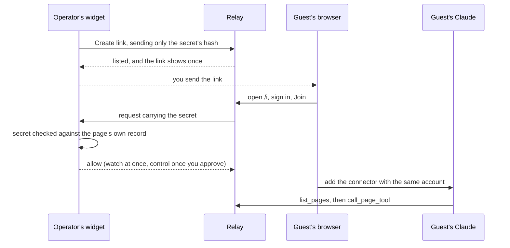

# Sharing a page

The person at the tab, the operator, decides who may use a page and what each person may do. This page covers those decisions as tasks. The widget is the operator's control surface; a page that hides it (`ui: false`) does the same through the adapter's handle ([adapter reference](04-adapter-reference.md)). [Connect clients](05-connect-clients.md) is the client's side.

## Who can reach a page

| Mode                | Who may ask to attach                                                                       | Pages attach from                                   |
| ------------------- | ------------------------------------------------------------------------------------------- | --------------------------------------------------- |
| Local               | You, from clients on the relay's computer holding the owner token                           | The relay's computer                                |
| Dev tokens          | Each user in `TABDOCK_DEV_TOKENS`, from the relay's computer                                | The relay's computer                                |
| Public URL (tunnel) | Members in `TABDOCK_OAUTH_USERS`, from anywhere; with `TABDOCK_INVITES=1`, guests by invite | The relay's computer                                |
| Hosted              | As public URL                                                                               | Anywhere, from origins in `TABDOCK_ALLOWED_ORIGINS` |

[Run a relay](07-run-a-relay.md) explains the modes and [Relay settings](08-relay-settings.md) each setting.

## Approve, and choose a role

When someone pairs by code or QR, the widget names them and their client and offers Allow as driver, Allow as observer and Deny. You have 60 seconds, and silence denies; a person's second device joins the request already shown. An observer may call only tools the page marks `readOnlyHint`, and a driver every tool. Writes run one at a time in arrival order, and reads run alongside.

`maxDrivers` in the page's policy (`data-max-drivers` on the script tag), from 1, the default, to 100, caps how many people may drive. It counts people, so one person's phone and laptop take one seat. Past it, Allow as driver seats the person as an observer: their client hears the role (`... as observer.`), and once the relay lists them the widget says, for Bob, "The page already has its maximum drivers, so Bob joined as observer." The page's console says the same, never that they drive; nor does it when you allow someone already attached, whose role the relay keeps. To seat another driver, make the current one an observer first, or raise `maxDrivers`.

A page holds at most 10 people (`TABDOCK_MAX_USERS_PER_PAGE`), and a full page refuses pairings with `page_busy` before asking you. With `autoApprove: 'observer'`, members who pair attach as observers with no prompt; invitees never do, and driving still takes your Make driver. That suits an unattended screen whose tools are all read-only.

## Change your mind

Each roster row shows the person, their clients, their role and their time left. Make driver and Make observer switch roles; Make driver at `maxDrivers` leaves the person an observer, and the widget and console say so: "The page already has its maximum drivers, so Bob is still an observer." The page judges a click by the roster the relay sends back for it, never an earlier one, so making one driver an observer and then another a driver hands the seat over without that notice. Should a roster sent for something else, such as someone leaving, cross your click and the relay then seat the person as a driver after all, the console says so and the notice goes.

Revoke ends an attachment at once, cancelling calls in flight and dropping queued ones, and the person must pair again like anyone new; Revoke all does that for everyone and closes every live invite. Pause answers `page_busy` to every call that has not started, queued ones and those waiting at your prompt included, while running calls finish, and holds across a reload until Resume. New code replaces a code that, say, was read off a shared screen. A reload in the same tab within 10 minutes keeps the page and its attachments; a closed tab leaves it asleep, then gone after 10 minutes, and a new tab is a new page needing new approvals.

## Try sharing on one computer

Dev tokens let you play two people on one machine. Make two tokens with the command in [Run a relay](07-run-a-relay.md#dev-tokens), put `TABDOCK_DEV_TOKENS=alice=<token>,bob=<token>` in the clone's `.env` and restart `pnpm dev`. That turns local mode off, so the `tabdock-local` entry answers 401 meanwhile. Give each person a client of their own: Claude Code in a folder per person, each running the `claude mcp add --transport http tabdock http://127.0.0.1:8787/mcp --header "Authorization: Bearer <token>"` line `pnpm dev` prints, filled in with that person's token, or the program in [Connect clients](05-connect-clients.md#any-mcp-client) with a token file per person.

Connect the board, pair alice with one code and bob with the next, and Allow alice as driver and bob as observer; a write from bob's client gets `role_denied`. Try Make driver on bob's row while alice drives, then Revoke. Remove the `.env` line and restart to go back to local mode.

## Invites

An invite admits someone off the member list. It needs a relay with a public URL and `TABDOCK_INVITES=1`, a page whose `policy.invites` allows it (`'watch'`, the default, or `'all'`), a member attached to sponsor it, and a secure context (https or localhost), since minting needs WebCrypto. In the widget choose Invite someone, give a label of up to 60 characters, pick Can watch or Can control and a lifetime (15 minutes, 1 hour, or while the page is open), and choose Create link. The link shows once, with a QR code, and the relay keeps only a hash of its secret.

|            | Can watch                           | Can control                                       |
| ---------- | ----------------------------------- | ------------------------------------------------- |
| Policy     | `invites: 'watch'` or `'all'`       | `invites: 'all'`                                  |
| Role       | Observer                            | Driver if a seat is free, else observer for now   |
| Uses       | 1 to 20 (1 by default)              | Exactly 1                                         |
| On joining | No prompt; a join notice names them | A prompt naming the account and your label        |
| Ends early | Cancel, Revoke all                  | Cancel, Revoke all, or three refusals or timeouts |

No invite lasts past 24 hours, and a page holds at most 10 live. The sponsor is the member attached longest at minting; when their attachment ends, so do their invites and every attachment those made. Guests always leave two of the page's seats to members.

At `/i` the guest sees who shared the page, its address and title, your label and what the invite allows, signs in with any account at the relay's provider and chooses Join; the page then tells them to add the connector with that account and ask Claude to list their pages. A one-use link also works in `pair_page`, but a multi-use one only at `/i`.

A guest's attachment ends within 24 hours, never gets first-class tools or confirmation in its client, and shows an invited badge, the verified email (or "unverified account") and a short id. Revoking a guest bars their account from that invite, and the "and close this link" box, ticked by default while a multi-use link has uses left, closes the link too. Cancel closes a link but keeps whoever it let in. Invites run with a stand-in provider in `pnpm demo:m4`, not yet with a real one ([the M5 checklist](../checklists/M5.md)).

## Confirmation in a member's own client

With `confirmVia: 'client'` (`data-confirm-via="client"`, or the demo board's `&confirm=client`) under `consequential: 'confirm'`, the default, a consequential call from a member driver whose attachment no invite made, through a client that declares form elicitation, is confirmed in that client. The page runs it without a prompt, and the activity list reads, for example, `confirmed in "claude-code <version>" by You`; everyone else still gets your prompt. A client may answer by itself (Claude Code can, through a hook), so turn this on only for members you trust with their own calls. [Connect clients](05-connect-clients.md#confirming-in-your-own-client) shows the question and what is not yet verified.

## Adding a member

A member is an entry `sub=userId:Display Name` in `TABDOCK_OAUTH_USERS`, where `sub` is the person's subject at the provider. A change takes a relay restart, which ends every page session, pairing and invite link; clients stay signed in, and pages pair again.

## The activity log and the audit log

The widget's activity list keeps the page's last 50 calls: time, person, client, tool, outcome and duration, never arguments or results. The relay's audit log keeps every attach, call, detach and invite redemption as hash-chained JSON lines, 30 days or 64 MiB by default, in `audit/` beside the owner token in local mode and in `TABDOCK_AUDIT_DIR` on a host, where production requires it. Read it with `pnpm audit:log` (with filters such as `--user`, `--page` and `--since`) and check the chain with `--verify`; once 0.1.0 is on npm, `npx @tabdock/relay audit` does the same. [Security](10-security.md) covers what the log proves.

Next: [Run a relay](07-run-a-relay.md).
