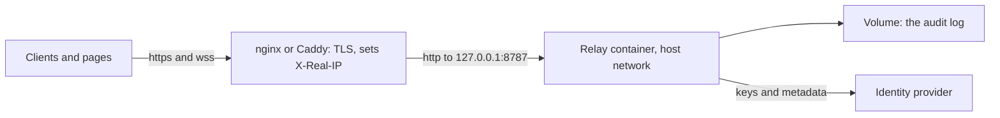

# Run a relay

The relay is one Node process with two doors: `/mcp`, the URL clients add, and `/page`, the socket pages dial. It never runs a tool, but it sees every call and result in plain text, as does anything that terminates TLS in front of it, so run your own. This page helps you pick a mode and run it; [Relay settings](08-relay-settings.md) lists every setting, and [the reference deployment](../deploy.md) is a worked example on a real host.

The commands below run in a clone (`git clone`, then `pnpm install`), since 0.1.0 is prepared but not yet on npm. Once 0.1.0 is on npm, `npx @tabdock/relay` runs the same command, `tabdock-relay`, on Node 22.18 or later, reading settings from the environment alone, never a `.env` file.

## Choose a mode

The relay picks its mode from its settings at start.

| Mode       | Selected by                                                                                 | Clients from        | Pages from                  | Sign-in        | QR and invites | Audit log on disk             |
| ---------- | ------------------------------------------------------------------------------------------- | ------------------- | --------------------------- | -------------- | -------------- | ----------------------------- |
| Local      | no sign-in setting, `TABDOCK_ENV` not `production`                                          | this computer       | this computer               | an owner token | no             | yes, beside the token         |
| Dev tokens | `TABDOCK_DEV_TOKENS`                                                                        | this computer       | this computer               | named tokens   | no             | only with `TABDOCK_AUDIT_DIR` |
| Public URL | `TABDOCK_PUBLIC_URL` with an identity provider                                              | anywhere, by tunnel | the relay's computer only   | the provider's | yes            | only with `TABDOCK_AUDIT_DIR` |
| Hosted     | public URL, `TABDOCK_ENV=production` and `TABDOCK_CLIENT_ADDRESS_HEADER`, behind a TLS edge | anywhere            | anywhere, on listed origins | the provider's | yes            | required                      |

Clients on your own computer, such as Claude Code, need only local mode. Claude on the web, desktop and phone connects from Anthropic's cloud, so it needs a public https URL: a tunnel for a session at your desk, a host for something that stays up. Pages on other people's computers need hosted mode.

## Local mode

`pnpm relay` starts it on `127.0.0.1:8787` (`pnpm dev` adds the demo board) and prints a line for Claude Code, as the [Quick start](02-quick-start.md) shows. Its one credential is an owner token in a private directory: `TABDOCK_HOME` when set (an absolute path), otherwise `~/.config/tabdock` on Linux, `~/Library/Application Support/Tabdock` on macOS or `%LOCALAPPDATA%\Tabdock` on Windows. The relay refuses rather than repairs a directory that lies in a work tree of git, Jujutsu, Mercurial, Sapling, Subversion or Bazaar, or, on macOS and Linux, below any directory another account owns or can write (so never under `/tmp`); on Windows it must lie under `%LOCALAPPDATA%` or `%USERPROFILE%`. If your home directory is itself a dotfiles repository, set `TABDOCK_HOME` outside it.

Local mode trusts every account on the computer, since nothing proves the relay to its clients; on a machine shared with people you do not trust, use a host with sign-in. One relay holds a token directory at a time, so `pnpm relay` beside a running `pnpm dev` refuses, naming the lock.

To rotate the token, stop the relay and run `pnpm relay --new-token`. The old token gets 401 at once. A Claude Code entry made with the `claude-headers` helper (macOS and Linux) needs no change; one made in PowerShell, which holds the token, must be removed and added again from the new banner.

## Dev tokens

For several named people on one computer, as in testing, set `TABDOCK_DEV_TOKENS=alice=<token>,bob=<token>`, each token 24 or more printable characters without spaces, for example from `node -e "console.log(require('node:crypto').randomBytes(24).toString('base64url'))"`. Clients send `Authorization: Bearer <token>`, and the relay stays on loopback.

## Public URL through a tunnel

You need a tunnel with a fixed https name, an identity provider, and six settings. The provider must offer the following, which WorkOS AuthKit does ([the reference deployment](../deploy.md#workos-authkit-production-workos) shows its switches); any other provider that does the same works without code changes.

| At the provider       | What the relay needs                                                                                                                                              |
| --------------------- | ----------------------------------------------------------------------------------------------------------------------------------------------------------------- |
| Metadata              | RFC 8414 or OpenID discovery naming the issuer exactly, S256 PKCE, and client ID metadata documents or dynamic registration                                       |
| The resource          | `<public URL>/mcp` as the access tokens' audience; make it the default where the provider allows, for clients that send no `resource`                             |
| Access tokens         | JWTs signed RS256 with keys at its `jwks_uri`, with a stable `sub`, `iat`, `jti` and an `exp` at most 120 minutes after `iat` (the default cap)                   |
| A confidential client | redirect URI `<public URL>/pair/callback`, scopes `openid email`, ID tokens with the same `sub`; it signs phones in at `/pair` and `/i`                           |
| Email, optional       | `urn:tabdock:email` (string) and `urn:tabdock:email_verified` (boolean) in access tokens, and `email` with `email_verified` in ID tokens, so guests show by email |

The six settings, in `.env` in a clone or in the environment:

```sh
TABDOCK_PUBLIC_URL=https://relay.example
TABDOCK_OAUTH_ISSUER=https://issuer.example
TABDOCK_OAUTH_USERS=<your sub at the provider>=alice:Alice
TABDOCK_PAIR_CLIENT_ID=<client id>
TABDOCK_PAIR_CLIENT_SECRET=<client secret>
TABDOCK_ALLOWED_ORIGINS=http://127.0.0.1:5173
```

`pnpm dev:public` starts this mode with the demo board, names any of the six that is missing, and prints the values to register at the provider (never the secret); `pnpm relay` starts the relay alone. Point the tunnel at `127.0.0.1:8787`. Keep the public `Host` header (do not rewrite it), pick a tunnel that streams responses (Cloudflare's quick tunnels do not carry server-sent events), and turn off any request inspector, which would show bearer tokens; with ngrok that is `ngrok http 127.0.0.1:8787 --url https://<your domain> --inspect=false`.

Pages still attach only from the relay's computer: `/page` refuses anything that came through the tunnel. Add the connector `https://relay.example/mcp` in Claude and Claude Code ([Connect clients](05-connect-clients.md)); a `tabdock-local` entry stops working, since local mode is off. The project has tested this mode against a stand-in tunnel and provider, but not yet through a real tunnel.

## Hosted on your own host

Hosted mode adds three settings to the six: `TABDOCK_ENV=production`, `TABDOCK_CLIENT_ADDRESS_HEADER` (one header your edge overwrites with the client's address, never one it appends to or passes through) and `TABDOCK_AUDIT_DIR`. `TABDOCK_ALLOWED_ORIGINS` lists your apps' origins exactly as browsers send them, and pages dial `wss://relay.example/page`. The host's duties (TLS, WebSocket upgrades, unbuffered answers, one instance with a disk, a public IPv4 address) are listed under [What a host and a provider must do](../deploy.md#what-a-host-and-a-provider-must-do).

No image is published yet, so build one in the clone: `docker build -t tabdock .`. The recipe below runs it on a Linux host behind a reverse proxy on the same machine:



The project checked it in its sandbox with Docker 29.6.2, nginx 1.28 and Caddy 2.11.7, using test certificates on other ports and a stand-in provider: health, sign-in, the tool list and a page socket all passed through each proxy, and a forged `X-Real-IP` was overwritten.

```sh
# /etc/tabdock/relay.env, mode 600: the six settings above, then
TABDOCK_ENV=production
TABDOCK_HOST=127.0.0.1
TABDOCK_CLIENT_ADDRESS_HEADER=x-real-ip
TABDOCK_TRUSTED_PROXY_CIDR=127.0.0.1/32
TABDOCK_AUDIT_DIR=/data/audit
```

```sh
docker volume create tabdock-audit
docker run --rm --user 0:0 -v tabdock-audit:/data --entrypoint /nodejs/bin/node \
  tabdock -e "require('node:fs').chownSync('/data', 65532, 65532)"
docker run -d --name tabdock --restart unless-stopped --network host \
  --read-only --cap-drop ALL --security-opt no-new-privileges \
  --env-file /etc/tabdock/relay.env -v tabdock-audit:/data tabdock
```

The second command hands the fresh volume to the image's user, uid 65532. With the host's network the relay listens on the host's loopback, where only the proxy should reach it; `TABDOCK_TRUSTED_PROXY_CIDR=127.0.0.1/32` makes the relay believe the header from that proxy, since the default trusts only the RFC 1918 ranges. Every local account can reach that port too, so use a host only you control.

nginx, inside the `server` block that holds your certificate:

```nginx
client_max_body_size 2m;
location / {
  proxy_pass http://127.0.0.1:8787;
  proxy_http_version 1.1;
  proxy_set_header Host $host;
  proxy_set_header X-Real-IP $remote_addr;
  proxy_set_header Upgrade $http_upgrade;
  proxy_set_header Connection $connection_upgrade;
  proxy_buffering off;
  proxy_read_timeout 300s;
  proxy_send_timeout 300s;
}
```

`$connection_upgrade` needs the usual `map $http_upgrade $connection_upgrade { default upgrade; '' close; }` in the `http` block. Caddy, which keeps the `Host` header and passes upgrades by itself (its automatic certificate was not part of the check):

```caddy
relay.example {
	reverse_proxy 127.0.0.1:8787 {
		header_up X-Real-IP {remote_host}
		flush_interval -1
	}
}
```

Without containers, a systemd unit can run a clone at `/opt/tabdock` after `pnpm install --prod --frozen-lockfile --filter '@tabdock/relay...'` there; keep no `.env` in it, since a checkout reads one for any variable the unit leaves unset. `systemd-analyze verify` accepts this unit, but the project has not run it under systemd.

```ini
[Unit]
Description=Tabdock relay
Wants=network-online.target
After=network-online.target

[Service]
User=tabdock
Group=tabdock
WorkingDirectory=/opt/tabdock
# The six settings and the hosted ones, with TABDOCK_AUDIT_DIR=/var/lib/tabdock/audit
EnvironmentFile=/etc/tabdock/relay.env
ExecStart=/usr/bin/node --max-old-space-size=192 /opt/tabdock/packages/relay/src/main.ts
StateDirectory=tabdock
StateDirectoryMode=0700
KillSignal=SIGTERM
TimeoutStopSec=10
Restart=on-failure
RestartSec=5
NoNewPrivileges=yes
ProtectSystem=strict
ProtectHome=yes
PrivateTmp=yes

[Install]
WantedBy=multi-user.target
```

The image caps the heap at 192 MiB, which holds the default byte budgets (`TABDOCK_MAX_TOOL_BYTES` and `TABDOCK_MAX_REQUEST_BYTES`). To raise those budgets on a larger machine, raise the heap with them: arguments after the image name replace its command, as in `docker run ... tabdock --max-old-space-size=384 packages/relay/src/main.ts`. A relay started with plain `node` has no such cap.

## Operating it

Run one relay per URL; a second one on the same audit directory refuses to start. Stop it with SIGTERM (Ctrl-C, `docker stop`, `systemctl stop`): it closes within about a second and releases its locks. Every restart forgets every page, attachment, pairing code, invite and `/pair` sign-in, so pages reconnect under new ids and people pair again, while clients stay signed in at the provider; only the audit log and local mode's token survive. Settings, members in `TABDOCK_OAUTH_USERS` included, take effect only at a restart.

To upgrade, read the [changelog](../../CHANGELOG.md) (while versions start with 0, a minor version may change settings), then `git pull` and `pnpm install` in the clone, or rebuild the image, and restart.

`pnpm audit:log` prints the audit log, filtered with `--user`, `--page`, `--type`, `--outcome`, `--since` and `--until`, and `--verify` checks its hash chain. In the container above, run `docker exec tabdock /nodejs/bin/node packages/relay/src/audit-cli.ts --dir /data/audit --since 24h`. [Reading the audit log](../deploy.md#reading-the-audit-log) explains the chain and its checkpoints.

If a client you trust is refused with 403 and the log shows `mcp request refused: origin not allowed`, add that origin to `TABDOCK_MCP_ALLOWED_ORIGINS`. [Troubleshooting](11-troubleshooting.md) covers other refusals, and [Security](10-security.md) what the relay can and cannot see.

## The reference deployment

[docs/deploy.md](../deploy.md) takes hosted mode from accounts to rollback on Fly.io, with WorkOS AuthKit and GitHub Actions.

Next: [Relay settings](08-relay-settings.md).
