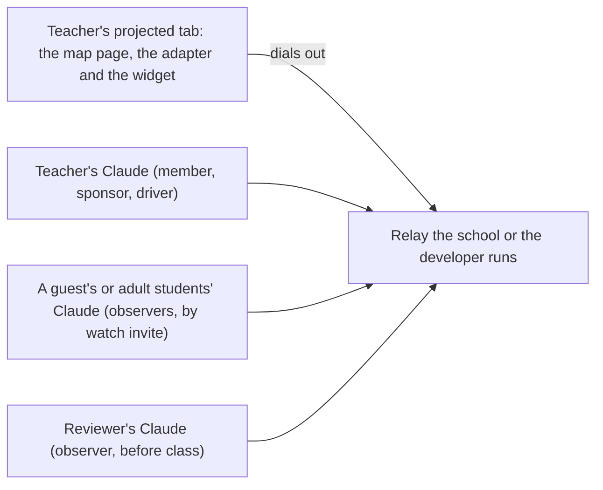

# Target scenario: a map and globe page in a classroom

This is the design Tabdock is heading toward for its first integration outside its own demo: a public map and globe viewer that teachers project in class. It describes the kind of page, not any one product, so the work it drives stays useful to every map page. ADRs 0038 to 0045 propose what it needs, and `docs/plans/backlog.md` gives their order.

## The page

A browser viewer for a planetary body, drawn as a 2D map or a 3D globe, with base layers, overlays and a clock. Its guided walkthroughs step a viewer through a story, one stop at a time. The richest one follows a flight past the body: a reconstructed path, a clock that plays at a chosen rate, a few dozen photos placed where they were taken, each with an estimated footprint, and a mode that compares a photo with the rendered view from the same point. The page already holds the view, the clock and the walkthrough in the browser, which is exactly what Tabdock's page tools reach.

## The people

The developer adds the adapter and registers the page's tools. A reviewer (a scientist or an educator) checks a walkthrough before it reaches a class. The teacher is the operator: the projected tab is theirs, they approve everyone, and their own Claude, attached as a member, sponsors the session and usually drives. A co-teacher or a guest expert joining from elsewhere attaches by invite. Students attach only where they may use an MCP client: Claude accounts require users to be 18 or older, so in a university class students can join from their own Claude, while a class under 18 follows the projector and asks through the teacher. Each person's client is their own; the shared thing is the one tab.

## A lesson, start to finish

**Integrate.** The page registers a small, shared set of map tools: read and move the view, set the clock, list layers, list walkthroughs and read any stop, read a photo's footprint and viewpoint, and capture the view (ADR 0038). Any tool names work today; the shared set lets one client skill drive every map page that adopts it.

**Check before anyone sees it.** On every change to a walkthrough, CI starts a local relay, opens the page in headless Chromium, answers the widget's attach prompt with Allow as driver as a person would, and walks every stop, asserting each one loads and each photo's viewpoint matches (ADR 0041). A model reviewing the overlays needs to see them, which needs image results (ADR 0039).

**Review.** The developer runs a time-boxed session (ADR 0043) and invites the reviewer as an observer. The reviewer's Claude reads every stop and footprint without moving the shared view, and proposes caption fixes through the page's own editing tool, which sits beside the shared set; each waits for the developer to accept on the page (ADR 0042). The developer downloads a record of the session: who joined, what was proposed, what was accepted (ADR 0045).

**Teach.** The teacher starts a session for the class period: their Claude as sponsor and driver, observers by watch invite, proposals on for invitees. Those who may attach scan the session's invite QR code and join as observers (ADR 0044). When someone asks about the view, one call to the page's published state tells their Claude the stop, the clock and the photo on screen without touching the page (ADR 0040), and it can look at the view itself (ADR 0039). Someone who wants the next photo proposes it; the teacher accepts on the page, and the whole room moves. When the period ends, the session ends every invite-made attachment.

**After class.** The teacher keeps the session record, or discards it.

## What works today

The teacher alone, with Claude Code in local mode on the classroom computer, can already drive the page through any tools it registers, and a read-only wall screen can take observers on the same machine (`docs/guide/09-use-cases.md`). Everything with other people in it needs a public URL and sign-in today, and with invites on a page takes at most eight invited people (ten less two member seats), which ADR 0044 addresses.

## What does not change

Every attachment is still approved on the page, or comes from a watch invite the operator minted while a member sponsors it (S4, S14). Page text, page state and page images still reach clients only behind the untrusted label (S10). Anonymous still means no account, never no identity (ADR 0016). The relay is still self-hosted, since it sees calls in plain text.

## Order of work

Priorities 1 to 8 in `docs/plans/backlog.md` follow this walk: first what one developer needs to integrate and check a page (ADRs 0038, 0039, 0040 and 0041), then what a room needs (ADRs 0042, 0043 and 0044), then the record (ADR 0045). Each ADR is Proposed and changes nothing until the owner accepts it.
