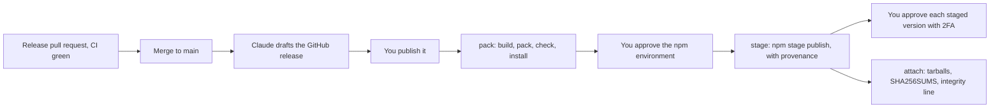

# Releasing Tabdock

Three packages go to npm together: `@tabdock/protocol`, `@tabdock/adapter` and `@tabdock/relay`, always at one shared version, with one entry in `CHANGELOG.md` and one tag, `v<version>` (ADR 0028). The protocol and the adapter ship compiled JavaScript with type declarations, the adapter also its script-tag build; the relay ships one bundled command, `tabdock-relay`, with its dependency tree pinned by an `npm-shrinkwrap.json`. Nothing is published under the unscoped name `tabdock`, and the sim page, the demo, the tour site and the tests stay private.

Publishing is staged: `.github/workflows/publish.yml` runs when you publish a GitHub release, waits for your approval in the GitHub environment `npm`, and stages the three versions on npm, where none goes live until you approve it with two-factor authentication. So every release takes two approvals by you, one on GitHub and one on npm, and a stolen CI credential can at most stage.

## Once, before the first release

These are yours, and `docs/checklists/M5.md` holds them as a click list. Create an npm account with two-factor authentication and the free organization `tabdock`. In the repository's settings, create the environment `npm`: you as required reviewer, self-review prevention off so a sole maintainer can approve, and deployment limited to tags matching `v*`. For the first versions no package exists yet to hold a trusted publisher, so give the environment one secret, `NPM_STAGE_TOKEN`: a granular token for the `@tabdock` scope that may only stage, without 2FA bypass, expiring after one day. Staging a package that does not exist yet makes npm publish a public placeholder, `0.0.0-stage`, which this route cannot avoid.

## Release day

**Recheck the exact SDK pins.** The relay pins the MCP SDK exactly (ADR 0027): `@modelcontextprotocol/server` 2.3.0, `@modelcontextprotocol/client` 2.3.0 (tests only), `@modelcontextprotocol/core` 2.3.0 through them, and `@modelcontextprotocol/node` 2.1.1, and the published shrinkwrap carries exactly what the workspace resolved. On release day run `npm view @modelcontextprotocol/server version`, the same for `client`, `core` and `node`, and `pnpm audit --prod`, and read the GitHub advisories for each package. If a newer version fixes a security issue, move the pin in its own pull request, which must pass CI, the client matrix and the conformance suite before the release goes on; otherwise keep the pins. Either way, record the check and its date in `docs/notes/verified.md`.

**The release pull request.** Bump every package's version together: the three `package.json` files, `ADAPTER_VERSION` in `packages/adapter/src/version.ts` and `RELAY_VERSION` in `packages/relay/src/mcp.ts`, which `script-options.test.ts` and `packages/relay/test/version.test.ts` hold equal to them. Move `CHANGELOG.md`'s Unreleased entries under the new version and date. CI must pass, the `pack-install` job included: it builds and packs the three tarballs (`pnpm release:pack`), checks them file by file (`pnpm release:check`), the relay's shrinkwrap holding every package its tree needs, `@tabdock/protocol` pinned to the very tarball packed beside it, and runs `npx @tabdock/relay@<version>` with a fresh npm cache through a local stand-in for the npm registry that serves the tarballs as npm will, then the installed command (`pnpm pack:install`), on Node 22.18 and on `.nvmrc`'s Node. Run the same three commands locally for a dry run; they publish nothing.

**Publish.** After the merge, Claude drafts a GitHub release for the tag `v<version>` on `main`'s merge commit, with the changelog entry as its notes. You publish it, from a phone if need be. That starts `publish.yml`: the pack job builds and checks the tarballs against the tag and installs them as CI did; the stage job then waits for you. Approve it in the GitHub app only for a run you started from a release you published. It stages protocol, adapter and relay, in that order, with `npm stage publish` on Node 24.21.0 and npm 11.19.0, with provenance. Then approve each staged version on npmjs.com with 2FA, after npm's malware scan, protocol first. The attach job adds the tarballs, `SHA256SUMS` and `tabdock-adapter.integrity.txt` to the release: the script-tag file's SRI digest and a ready jsDelivr tag pinned to the version.

**Check.** Each package's page on npm shows the version and its provenance; `npx @tabdock/relay@<version> --version` prints the version; and the integrity line's digest matches `https://cdn.jsdelivr.net/npm/@tabdock/adapter@<version>/dist/tabdock-adapter.js`. If provenance is missing on the first versions, which rest on reading npm's source rather than a live run, the release stands and the next one, from the trusted publisher, carries it.

## After the first release

Add a trusted publisher to each of the three packages: this repository, the workflow `publish.yml`, the environment `npm`, staged publishing only. Then delete `NPM_STAGE_TOKEN` from the environment, revoke the token on npm, and set each package to "Require two-factor authentication and disallow tokens". From then on the stage job's OIDC token is the only credential, and it can only stage.

## When something goes wrong

A staged version you have not approved can be discarded on npm, and nothing reached anyone. A version already live is never unpublished: deprecate it with `npm deprecate @tabdock/<name>@<version> "<why>"` and release a fixed version through the same steps. The shrinkwrap means a fixed transitive dependency reaches `npx` users only in a new relay release, so a security fix anywhere in the relay's tree is a release, which Dependabot's pull requests prompt.
