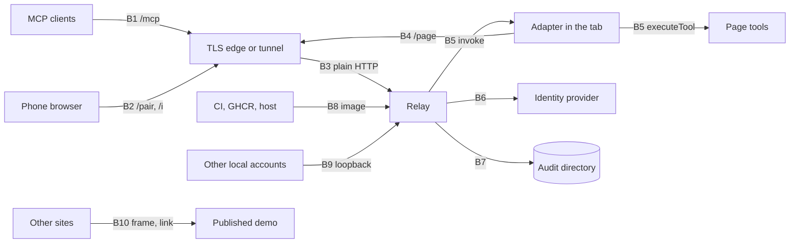

# Threat model

Tabdock as merged for M4 on 4 October 2026: local mode, public URL mode behind a tunnel, hosted mode behind a host edge, signed-in invites, the persistent audit log, the container image and its workflows. It follows the OWASP Threat Modeling Cheat Sheet: four questions, STRIDE (spoofing, tampering, repudiation, information disclosure, denial of service, elevation of privilege) applied to each trust boundary, and each threat sorted into mitigate, eliminate, transfer or accept. SPEC section 9 numbers the requirements (S1 to S14); ADRs 0013, 0014 and 0016 to 0022 hold the decisions behind them. When code, tests or this page disagree, the tests and SPEC win and this page is the one to fix.

## 1. What are we working on?

A page adapter dials out from the operator's tab to the relay; MCP clients reach the relay at one URL; the person at the tab approves every attachment, at the time or in advance through an invite minted on that page (SPEC section 2, the root of trust). The relay is one process with an in-memory store and only one thing on disk besides local mode's owner token: the audit log (ADR 0019).

**Assets.** The operator's tab, which acts in their name; calls, arguments and results, plaintext at the relay and at any edge or tunnel in front of it; credentials (access tokens, the `/pair` client secret, the `__Host-` session and login cookies, pairing codes, QR nonces, invite secrets, resume tokens, local mode's owner token); the member allowlist and the origin list; the audit log; the image and what it is built from; and the relay's capacity, page slots above all.

**Actors.** The operator; members on `TABDOCK_OAUTH_USERS`; invitees, which with invites on is any account the provider signs in (sign-up is open on the reference deployment, ADR 0020); anyone on the internet; a script that opens `/page` claiming an allowed origin, which `Origin` cannot stop outside a browser; a hostile page, or page script running after `attach()`; a prompt-injected MCP client; the host, its edge or a tunnel; the identity provider; other accounts on a local-mode machine; npm, base images and GitHub Actions.

## 2 and 3. What can go wrong, and what are we doing about it?

One row per boundary. "Tests" names the suites that pin the controls: relay suites live in `packages/relay/test`, adapter ones in `packages/adapter/test`, in-process end-to-end ones in `tests/e2e/test` and browser specs (`*.spec.ts`) in `tests/e2e/specs`; a name that two places share says which it means.

| Boundary                                                       | STRIDE: threat and control                                                                                                                                                                                                                                                                                                                                                                                                                                                                                                                                                                                                                                                                                                                                                                                                                                                                                                                                                                                                                                                                                                                                                                                                                                                                                                                                                                                                                                                                                                                                                                                                                                          | S                                   | Tests                                                                                                                                                                                                                                                                                                                                   | Residual (accepted unless marked)                                                                                                                                                                                                                                                                                                                                                                                                                                                                                                                                                                                                                                                                                                                                                                                                                                                                                                                                                                                                                                                                                                                                                                                                                                                                                                                                                                                                                                                                                                                                                                                                                                                                                                                                                                                                                                                                                                                                                                                                                           |
| -------------------------------------------------------------- | ------------------------------------------------------------------------------------------------------------------------------------------------------------------------------------------------------------------------------------------------------------------------------------------------------------------------------------------------------------------------------------------------------------------------------------------------------------------------------------------------------------------------------------------------------------------------------------------------------------------------------------------------------------------------------------------------------------------------------------------------------------------------------------------------------------------------------------------------------------------------------------------------------------------------------------------------------------------------------------------------------------------------------------------------------------------------------------------------------------------------------------------------------------------------------------------------------------------------------------------------------------------------------------------------------------------------------------------------------------------------------------------------------------------------------------------------------------------------------------------------------------------------------------------------------------------------------------------------------------------------------------------------------------------- | ----------------------------------- | --------------------------------------------------------------------------------------------------------------------------------------------------------------------------------------------------------------------------------------------------------------------------------------------------------------------------------------- | ----------------------------------------------------------------------------------------------------------------------------------------------------------------------------------------------------------------------------------------------------------------------------------------------------------------------------------------------------------------------------------------------------------------------------------------------------------------------------------------------------------------------------------------------------------------------------------------------------------------------------------------------------------------------------------------------------------------------------------------------------------------------------------------------------------------------------------------------------------------------------------------------------------------------------------------------------------------------------------------------------------------------------------------------------------------------------------------------------------------------------------------------------------------------------------------------------------------------------------------------------------------------------------------------------------------------------------------------------------------------------------------------------------------------------------------------------------------------------------------------------------------------------------------------------------------------------------------------------------------------------------------------------------------------------------------------------------------------------------------------------------------------------------------------------------------------------------------------------------------------------------------------------------------------------------------------------------------------------------------------------------------------------------------------------------- |
| **B1** MCP clients to `/mcp` and its metadata                  | S: forged, foreign or stolen tokens; `jose` checks signature, issuer, audience (`<public URL>/mcp`), `exp`, required `iat` and `jti`, a 2-hour `maxTokenAge` and `exp - iat` cap, and the optional client list; local mode compares its token's digest. R: every call that reaches a page has a `call` line. I: a user lists and calls only pages it holds; errors are fixed phrases; no token text in any line. D: a per-user request budget (240 a minute, 60 for invitees), which also counts each 2026-07-28 `subscriptions/listen` request and each 2026-07-28 request the SDK refuses before a tool runs, runs before the access check; caps on 2025-era sessions, and the same caps on listen streams counted apart, with an invitee pool in which a session or stream gives way only to a newcomer ranked above its holder (a stranger below a guest below a member) or, an idle session, to one of its holder's rank, and a stream only once the SDK has served the listen that needs its place; a body cap of two page frames, read once, and of 16 KiB for a listen; call limits and queue depth; the lines a signed-in client can cause at will (the SDK's refusals, refused or evicted sessions, refused listens) written once per kind a minute and counted after, an error's message cut to 200 characters (ADRs 0018 and 0019, second A4.3 notes). E: invitees see only held pages, get `invite_required` for a code, and never pass an invite's role; an attachment an invite made lists and calls its page only while its sponsor and each member above them are within their time, however late a timer runs; observers run read-only tools only | S5, S7, S9, S11, S13, S14           | `oauth.test.ts`, `oauth-hardening.test.ts`, `oauth-jwks.test.ts`, `mcp.test.ts`, `invitee-tier.test.ts`, `listen-streams.test.ts`, `listen-heap.test.ts`, `mcp-log-budget.test.ts`, `repeated-lines.test.ts`, `logging.test.ts`, `invites.test.ts`, `sessions.test.ts`, `rate-limit.test.ts`, `m4-seams.test.ts`, `role-checks.test.ts` | Bearer tokens live to `exp` with no deny list (ADR 0020). Until `TABDOCK_OAUTH_CLIENT_IDS` is set, a client registered dynamically can phish a member's consent. Sign-up is open, so the allowlist is the real gate and any stranger can spend an invitee's budgets. Strangers holding busy 2025-era sessions or listen streams can fill the invitee pool against other strangers, never against a guest or a member (ADR 0016's notes), and a guest or member can end the streams of those ranked below it at one budget request each, by opening a stream and dropping it. With invites off, ADR 0020's 403 line for a signed-in account the relay does not admit is written for every request, uncollapsed by that ADR's choice. A prompt-injected client acts within its user's roles and the page's prompts. `/mcp` counts nothing per address, since hosted Claude shares one range                                                                                                                                                                                                                                                                                                                                                                                                                                                                                                                                                                                                                                                                                                                                                                                                                                                                                                                                                                                                                                                                                                                                                                   |
| **B2** Browsers to `/pair` and `/i`                            | S: forged sign-ins; `openid-client` checks state, nonce, PKCE and the ID token's signature, and the sign-in returns only to `/pair` or `/i`. T: secrets ride in the URL fragment, leave the address bar at once, and claims need a same-origin POST and a click on Join; pages run under a CSP with no inline script. I: an unknown, used or expired nonce or invite, or an invite whose sponsor is past their end, gets one answer and costs nothing; a live preview shows origin, title and label marked as the page's words, and the sponsor. D: per-nonce and per-invite preview limits; the sign-in gate (60 a minute and 8 in flight relay-wide, and in hosted mode 10 and 2 per client address, `/i`'s sign-ins included). E: an invitee's pairing code gets `invite_required` before the nonce is read, and a non-member gets 403 with invites off                                                                                                                                                                                                                                                                                                                                                                                                                                                                                                                                                                                                                                                                                                                                                                                                          | S3, S4, S9, S10, S11, S14           | `pair.test.ts`, `pairing.test.ts` (relay and end-to-end), `invite-page.test.ts`, `invites.test.ts` (relay), `hosted.test.ts`, `pair.spec.ts`, `invite-journey.spec.ts`                                                                                                                                                                  | Behind a tunnel the gate is relay-wide, so anyone who knows the URL can stall QR and `/i` sign-in at about a request a second (ADR 0013). Behind a host edge each client address gets only its share, but about six addresses (an IPv6 key is a /56) together spend the relay-wide 60 a minute and stall QR and `/i` sign-in for everyone (ADR 0018). Either way, pairing by code from Claude is unaffected. A look-alike page can phish someone shown a link. A redeemed link's remaining uses are only as safe as the relay (ADR 0017)                                                                                                                                                                                                                                                                                                                                                                                                                                                                                                                                                                                                                                                                                                                                                                                                                                                                                                                                                                                                                                                                                                                                                                                                                                                                                                                                                                                                                                                                                                                    |
| **B3** Edge or tunnel to the relay                             | S: a forged client address; the configured header is believed only from `TABDOCK_TRUSTED_PROXY_CIDR`, must appear once and parse, or `/page`, `/pair` and `/i` answer 400; any other peer counts as itself and is logged. Host names are matched as written, a malformed or repeated `Host` gets 400, and the platform's own name gets 403 everywhere but `/healthz`. Only hosted mode may bind `0.0.0.0`, never `::`; without a public URL every `Forwarded` or `X-Forwarded-*` request gets 403. I: TLS ends at the edge, which sits inside the relay's trust boundary. D: hosted defaults of 100 page sessions and 5 sockets and 5 sessions per address, an IPv6 /56 counted as one                                                                                                                                                                                                                                                                                                                                                                                                                                                                                                                                                                                                                                                                                                                                                                                                                                                                                                                                                                              | S9, S12                             | `hosted.test.ts`, `hosted-main.test.ts`, `config.test.ts`, `public-mode.test.ts`, `local-mode.test.ts`, `deploy-files.test.ts`                                                                                                                                                                                                          | The edge, like the M3 tunnel, sees every call and result in plaintext (ADRs 0014 and 0018). A range left at its RFC 1918 default, or a host whose header can be forged, weakens every per-address limit; narrowing it is a deploy step. Twenty client keys (an IPv6 key is a /56, so one /48 holds 256) can hold every page slot, and a further key can then end the page asleep longest, an availability cost (ADRs 0009 and 0018)                                                                                                                                                                                                                                                                                                                                                                                                                                                                                                                                                                                                                                                                                                                                                                                                                                                                                                                                                                                                                                                                                                                                                                                                                                                                                                                                                                                                                                                                                                                                                                                                                         |
| **B4** Pages to `/page`                                        | S: the origin comes only from the `Origin` header and must be listed; production refuses to start without a list. T: every frame is parsed with zod and capped at 1 MB; resume tokens are kept as digests. R: what the operator causes (roles, revokes, mints, closes) is audited, and a page may make 10 promotions and mints together per window (`OPERATOR_GRANTS_PER_PAGE`), which bounds the audit lines a credential-free page can cause. D: per-socket and per-address budgets for `tools` frames, past which the socket is closed with 1008, and for the lines of frames that change nothing (20 and 60 a minute), past which those lines are counted and no page is closed (ADR 0023); a first frame other than `hello` closes its socket, spending nothing of its address; a decision the page is expected to send for a request the relay just ended is not counted, and the adapter sends none for requests its own revoke ends; schema node caps, the argument check in a worker, and one relay-wide budget for what tool lists hold on the heap (64 MiB with a 192 MB heap, ADR 0018). E: minting needs a member attached as sponsor, within their time with each member above them, and the page's policy, and a redemption reaches the page, or is granted on approval, only while that sponsor and each member above them are within their time, however late a timer runs; the relay grants an invite-made attachment no more than the invite's role and refuses `set_role` past it                                                                                                                                                               | S1, S2, S9, S10, S14                | `page-link.test.ts`, `hub.test.ts`, `limits.test.ts`, `tools-flood.test.ts`, `tool-bytes.test.ts`, `tool-heap.test.ts`, `invites.test.ts` (relay), `operator.test.ts` (adapter), `policy.test.ts` and `operator-controls.test.ts` (end-to-end)                                                                                          | `/page` takes no credential, so a script can claim any listed origin and only the caps bound it; the sponsor rule keeps it from minting. Frames that change nothing write at most 20 lines a minute from a socket and 60 from an address, then one count per address a minute; anyone sharing a page's address can spend that address's lines, so the operator's own such lines may only be counted, never its page closed. `tools` frames stay within their own budgets. Each connection a script opens can still write a line or two to the stderr copy that holds the audit checkpoints, bounded only by how fast it connects (ADR 0018's notes). A member attached to many pages can make each of them write its bounded role and invite lines, all attributed. The argument check is advisory, so pages check their own arguments (ADRs 0008, 0010). On the MCP-B polyfill a write can hold the page until its deadline plus 2 s (ADR 0012)                                                                                                                                                                                                                                                                                                                                                                                                                                                                                                                                                                                                                                                                                                                                                                                                                                                                                                                                                                                                                                                                                                            |
| **B5** Relay to adapter, and adapter to page tools             | S: the adapter does not trust the relay: it honours an invite only against its own record and the presented secret's SHA-256, so a relay cannot invent a redemption; `autoApprove` never covers an invitee; an answer binds to the very request record it was asked about, since relays may reuse request ids. T and E: calls run under the least of the page's grant, the roster and the invoke's role; consequential tools prompt and a timeout denies; no redemption clears a revoke, and Revoke bars the account from that invite. I: invite records keep hash and terms only, in `sessionStorage`. Page script after `attach()`: WebCrypto's `getRandomValues` and `digest`, `TextEncoder.encode`, `Uint8Array` and the typed array length getter, the base64url digits, `JSON.parse` and `JSON.stringify`, the page link's socket (its constructor, `send`, `close` and `addEventListener`, and the getters of the events it fires) and the clipboard's `writeText` are taken by the time `attach()` returns, and every DOM call the widget makes on its nodes, the timers its hold-still wait runs on and the `DOMRect` getters it measures boxes with go through functions taken at mount, so a later script that patches any of those is handed no secret, no frame's text in either direction and no node of the widget (and so not its closed shadow root), arms no box early and keeps no moved box armed; the widget takes only trusted clicks on boxes that held still. These narrow the routes; they are no boundary (see residual risk)                                                                                                             | S4, S5, S6, S8, S10, S14            | `core.test.ts`, `operator.test.ts`, `invites.test.ts`, `invite-records.test.ts` and `later-scripts.test.ts` (adapter), `role-checks.test.ts`, `operator-controls.test.ts`, `widget.spec.ts`, `invites.spec.ts`, `later-scripts.spec.ts`                                                                                                 | A relay can still refuse, delay, or redeem a link it has seen, up to its remaining uses. Under the trusted-page rule (SPEC section 2, since such a script can run the page's tools itself), page script that runs after `attach()` keeps at least these four routes (the ones found so far; there may be more). First, an invite secret still passes through the page's JavaScript built-ins: the protocol's zod checks call `RegExp.prototype` on its way into a link and out of each redemption frame, the core holds a mint in a `Map` and resolves a `Promise` with its link, and the QR encoder calls string methods; so such a script can read a secret as it is minted and as each redemption arrives, a multi-use Can watch link's included, for its remaining uses. Second, the widget keeps its nodes and its boxes in its own `Map`s, `Set`s and arrays, and reads the tab's visibility from the page's `document`, so patching those reaches its nodes and through them the closed shadow root, to read or rewrite the panel, and can arm a box the moment it appears or keep one armed when the tab comes back into view. Third, frames still pass through the page's built-ins as objects: the protocol's checks hand each relay frame, once parsed, and each frame the page sends to them (`Array.isArray` among them), and the taken `JSON.stringify` still calls any `toJSON` such a script defines (on `Object.prototype`, say); so it can read and rewrite frames either way, down to the name a prompt shows and the operator's real Deny, which then leaves as Allow as driver. Fourth, with no access to the widget at all, it can draw an element of its own over the panel that labels Allow as Deny, and the operator's trusted click on a box that held still then allows. Copy puts the link on the clipboard. The page's clock decides expiry on the page: one running ahead stretches a short invite by the skew, never past 24 hours on the relay's clock, and one behind by more than the lifetime gets `expired` (ADR 0017) |
| **B6** Relay to identity provider                              | S: start checks (issuer, S256, metadata documents or registration); an hourly re-read refuses a new issuer or key URL; UserInfo is asked only for invitees, against the expected subject. T: keys cached 10 minutes with a 30 s cooldown, set explicitly. I: the `/pair` client secret goes only to the token endpoint. D: an unfetchable key set answers 503 with `Retry-After`, never a sign-in loop. E: email claims are parsed with zod, identity stays `sub`, a missing claim shows as an unverified account, and a revoke bars the account and its folded verified email                                                                                                                                                                                                                                                                                                                                                                                                                                                                                                                                                                                                                                                                                                                                                                                                                                                                                                                                                                                                                                                                                      | S11, S14                            | `oauth.test.ts`, `oauth-hardening.test.ts`, `oauth-jwks.test.ts`, `pair.test.ts`                                                                                                                                                                                                                                                        | Transferred: the provider holds every sign-in, and whoever controls it controls every identity. A key rotation can cost about 330 s of 401s. Whether revoking a session ends issued tokens, and how the JWT template renders `email_verified`, wait for the owner's production run                                                                                                                                                                                                                                                                                                                                                                                                                                                                                                                                                                                                                                                                                                                                                                                                                                                                                                                                                                                                                                                                                                                                                                                                                                                                                                                                                                                                                                                                                                                                                                                                                                                                                                                                                                          |
| **B7** Relay to its audit directory                            | T: each line carries the SHA-256 of the one before, chained across files, with a checkpoint to stderr at start, every 15 minutes, at rotation, after retention deletes and at stop, whose `first` moves only when retention deletes the oldest file that run found or made, to the next such file, so a file removed while it runs shows, and one planted, grown or cut while it runs is named and moves nothing, since the size cap counts only the bytes the run found or wrote; one writer per directory, across containers whatever their clocks. R: calls, attachments, refusals, roles, revokes and invite lifecycles, each line schema-checked. I: never arguments, results, tokens, codes, nonces, invite secrets or their hashes, cookies, `sub`, addresses or page-written labels; an invitee's email only in its `attach` record and never on stderr; directory 0700, files 0600. D: refusals that reach no page write their own line within a budget (10 a minute per account, 30 shared by accounts holding no attachment), then a summary a minute; rotation at 8 MiB or midnight, kept 30 days or 64 MiB; a failing disk fails open and leaves an `audit_gap`, kept across a restart in `audit.gap`, which a full disk still takes                                                                                                                                                                                                                                                                                                                                                                                                                   | S7, S11                             | `audit-file.test.ts`, `audit-relay.test.ts`, `invitee-tier.test.ts`, `hosted.test.ts`, `invite-journey.spec.ts`                                                                                                                                                                                                                         | The chain is evidence, not prevention: whoever holds the host can rewrite what follows the last checkpoint the platform still keeps. A start takes the files it finds as given, sizes included, so a change made while no relay ran that leaves the start's checkpoint the stop's (a file removed from the middle, or from the start with another planted under the old `first`'s name, or the oldest renamed to an older day) can no longer be told from retention's own work once retention deletes the files before it, and a file planted or grown then counts toward the size cap at its size, so the start's retention may delete the oldest files for it, under lines whose `total` runs far past what the files hold. S7 narrows as the owner accepted (ADR 0019): past a budget a refused call loses its tool and client, and a stranger outside the 20 busiest keeps only its outcome; during a gap records live only in platform logs (7 days on Fly). Invitee emails stay on disk for the retention period                                                                                                                                                                                                                                                                                                                                                                                                                                                                                                                                                                                                                                                                                                                                                                                                                                                                                                                                                                                                                                      |
| **B8** CI to registry to host                                  | S and T: base images pinned by digest and actions by commit SHA; builds from the Git context, never `.env`; a distroless runtime as uid 65532 that owns none of its code, `/app` itself included, so even on Fly's writable root it cannot change the code the owner later runs as root, such as the audit reader; SBOM, SLSA provenance and a GitHub attestation; a deploy only by manual dispatch on `main`, of a digest whose attestation names the Image workflow, behind the `production` environment's required reviewer; secrets staged on standard input. I: secrets only as environment secrets, never build arguments. D: one instance with its volume; Dependabot keeps pins current                                                                                                                                                                                                                                                                                                                                                                                                                                                                                                                                                                                                                                                                                                                                                                                                                                                                                                                                                                     | Supply chain; S7 and S12 rest on it | `deploy-files.test.ts`, `scripts/smoke-image.ts` (CI), Grype in the Image workflow                                                                                                                                                                                                                                                      | Transferred to npm and the base images: the pinned runtime packages are trusted as published. Grype's 31 matches had no fix on 4 October and are accepted until one exists. A deploy token can reach its organisation's private network, so the checklist gives Tabdock an organisation of its own. Every deploy is a restart that detaches everyone and kills live invite links (ADR 0019)                                                                                                                                                                                                                                                                                                                                                                                                                                                                                                                                                                                                                                                                                                                                                                                                                                                                                                                                                                                                                                                                                                                                                                                                                                                                                                                                                                                                                                                                                                                                                                                                                                                                 |
| **B9** Local mode: other accounts and processes on the machine | S: the relay listens only on a loopback literal it resolved itself, refuses proxied requests, and serves one user, `you`, with a 256-bit token in a 0700 directory and 0600 file outside the checkout, refused rather than repaired when anything about them is off; the printed Claude Code line reads the file, so no screen or shell history holds the token. E: local mode decides who may call `/mcp`, never who reaches a page: the operator still approves each attachment. Refused in production, with a public URL and off loopback, under any plugin name                                                                                                                                                                                                                                                                                                                                                                                                                                                                                                                                                                                                                                                                                                                                                                                                                                                                                                                                                                                                                                                                                                 | S4 to S8, S11, S12, S13             | `local-mode.test.ts` (relay and end-to-end), `local-token.test.ts`, `local-banner.test.ts`, and `check:claude-code:local` with an installed Claude Code                                                                                                                                                                                 | Local mode trusts every account on the machine (ADR 0022): another can bind the port while the relay is down and receive Claude Code's token and the pages' `hello` frames, then raise attach requests of its own, and every local process shares the per-address page limits. User scope gives every Claude Code session the relay's tools, so a prompt injected into any of them acts on pages `you` holds, within roles and prompts. `claude mcp get` prints the token, `~/.claude.json` keeps a copy, and command-line auditing (auditd, Windows event 4688, EDR agents) records it while the printed command runs. On a shared machine, run a relay with sign-in instead                                                                                                                                                                                                                                                                                                                                                                                                                                                                                                                                                                                                                                                                                                                                                                                                                                                                                                                                                                                                                                                                                                                                                                                                                                                                                                                                                                               |
| **B10** Other sites to the published demo                      | S: the relay's origin list names only the demo's own origin on its custom domain. T: a static host cannot send `frame-ancestors`, so the board refuses to link inside a frame in every build, and an https copy needs a `wss:` relay off loopback. E: domain takeover is guarded by verifying the domain for Pages first, no wildcard record, and removing the origin from the list before the record when the demo retires                                                                                                                                                                                                                                                                                                                                                                                                                                                                                                                                                                                                                                                                                                                                                                                                                                                                                                                                                                                                                                                                                                                                                                                                                                         | S1, S2                              | `invites.spec.ts`, `apps/demo/src/relay.test.ts`, `apps/demo/src/policy.test.ts`                                                                                                                                                                                                                                                        | A framing site can still draw a look-alike page of its own. The guard holds only while it is followed (ADR 0021). On `<user>.github.io` instead, the origin list entry would cover every project site under the account                                                                                                                                                                                                                                                                                                                                                                                                                                                                                                                                                                                                                                                                                                                                                                                                                                                                                                                                                                                                                                                                                                                                                                                                                                                                                                                                                                                                                                                                                                                                                                                                                                                                                                                                                                                                                                     |

## 4. Did we do a good enough job?

Every row's controls have automated tests, and A4.1 is the claim that S1 to S14 all do: `pnpm test` runs the relay, adapter, protocol and in-process end-to-end suites, and `pnpm test:e2e` the browser specs, among them `invite-journey.spec.ts`, which walks one watch and one control invite from the widget to Revoke all and checks the audit file with `pnpm audit:log --verify`. Each milestone's section 9 review left its findings fixed and tested: M2's session flooding, `tools` frame budget and validator blow-up; M3's one medium and twelve lows; and M4's workstream reviews, whose fixes are in the notes of ADRs 0017 to 0020 and `docs/plans/M4.md`. Integration added the hosted test that `/i` keeps the client address rule and shares the per-address sign-in share. A4.3 asks a separate reviewer to run the section 9 lenses plus supply chain over the merged tree, with a skeptic re-checking each finding and a fresh agent finding no unaddressed high-severity issue; its result goes beside this page in the M4 report.

What the sandbox cannot show waits on the owner's devices (`docs/checklists/M4.md`): a real provider issuing the namespaced email claims, the production token lifetime, a live `/i` sign-in from a phone, the page socket through Fly's edge, and the narrowed proxy range. Each residual risk above is accepted by an ADR or transferred to a party the deployment already trusts; this page changes when one of those decisions does.
