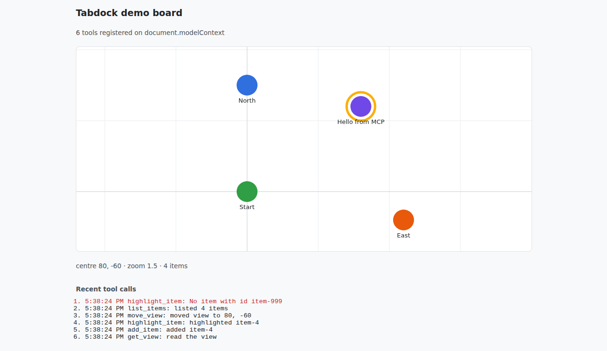
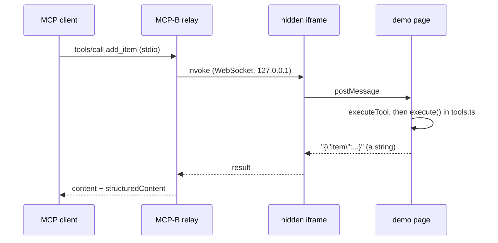

# 00: The baseline we build on

M0 builds nothing Tabdock-specific on purpose. It gives us a page with real tools and measures how today's best local option, MCP-B's local relay, carries them to an MCP client, so M1 starts from facts instead of guesses.

## What exists now

`apps/demo` is a canvas board: items you can pan and zoom around, plus six tools registered on `document.modelContext`. Two only read (`get_view`, `list_items`), three change things (`add_item`, `move_view`, `highlight_item`) and one is consequential (`clear_board`). The state lives in a plain class (`apps/demo/src/board.ts`); the tools wrap it with zod-checked arguments (`apps/demo/src/tools.ts`); the page redraws on every change and keeps a strip of recent calls (`apps/demo/src/render.ts`). On browsers without native WebMCP, MCP-B's polyfill supplies `document.modelContext` (`apps/demo/src/main.ts`).

`tests/e2e` wires the baseline: the page in headless Chromium, MCP-B's relay as a stdio MCP server, and the official MCP client standing in for Claude Code (`tests/e2e/src/harness.ts`).

## One call, traced

The client sends `tools/call` with `{ label, x, y }` over stdio. The relay checks the arguments against the tool's JSON Schema, then forwards them over a localhost WebSocket to a hidden iframe that `embed.js` injected into the page (loaded by `loadMcpbRelayEmbed` in `main.ts`). The iframe posts the request to the page, where the embed script looks the tool up with `getTools()` and runs it with `executeTool()`. That lands in the `execute` function built by `defineTool` in `tools.ts`, which parses the arguments with zod, calls `Board.addItem`, and logs the call for the strip. The board emits a snapshot and `render.ts` draws the new circle. The return value travels back as a JSON string, and the relay turns it into MCP `structuredContent`.

Two surprises shaped the notes. The input format of `executeTool` changes in Chrome 155, so MCP-B's 5.1.0 relay breaks there. And the polyfill drops `consequentialHint`, so nothing on this path knows `clear_board` is dangerous: it runs with no prompt. `docs/notes/baseline.md` has the measurements; ADRs 0001 and 0002 propose how Tabdock copes.

## Try it by hand

1. Run `pnpm dev`, open `http://127.0.0.1:5173/`, and in the DevTools console call a tool yourself: `const t = (await document.modelContext.getTools()).find(x => x.name === 'add_item'); await document.modelContext.executeTool(t, JSON.stringify({ label: 'me', x: 50, y: 50 }))`. (Native Chrome 155 and later want the object itself, without `JSON.stringify`.) Watch the circle and the strip.
2. Register a tool live: `await document.modelContext.registerTool({ name: 'say_hi', description: 'Says hi', inputSchema: { type: 'object' }, execute: () => 'hi' })`. With the relay attached (see `docs/checklists/M0.md`), Claude Code sees it without a restart, thanks to `tools/list_changed`.
3. Open the same page as `http://localhost:5173/?mcpb` while the relay allows only `http://127.0.0.1:5173`. The tools never reach Claude: the relay's origin allowlist reads the WebSocket `Origin` header, the same rule Tabdock's S1 adopts.
