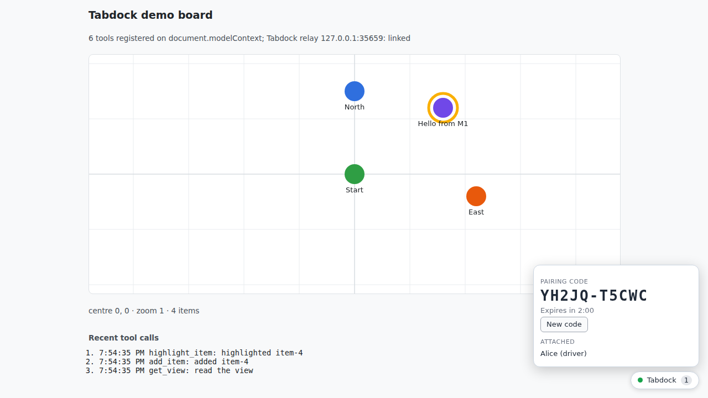
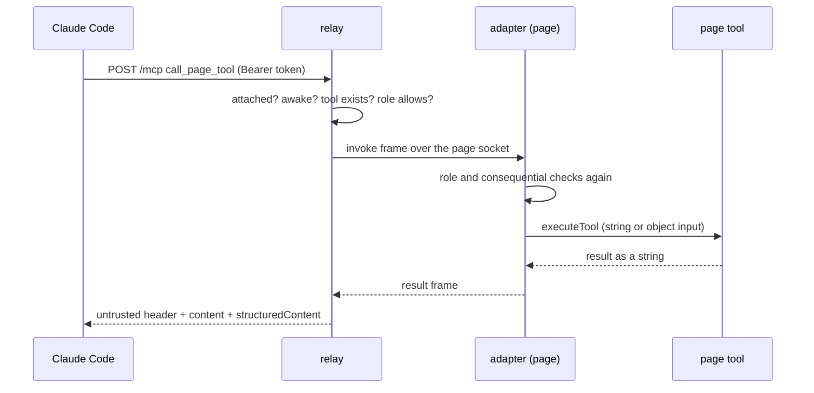

# 01: The walking skeleton

M1 is the first time Tabdock itself carries a call: a page dials the relay and shows a code, a client pairs with it, the person at the tab approves, and the client calls the page's tools. Everything runs on one machine with dev tokens.

## What exists now

`packages/protocol` defines every frame between page and relay as a zod schema, plus the shared limits and timings. `packages/relay` is one Node process: `relay.ts` checks each page socket's `Origin` before upgrading and serves `/mcp` through the official SDK; `hub.ts` owns page sessions, pairing codes, attachments and calls; `mcp.ts` defines the five fixed tools; `auth.ts` holds the dev-token plugin. `packages/adapter` is the page side: `core.ts` holds all the behaviour with no DOM, `widget.ts` draws the badge and prompts in a closed shadow root, and `attach()` in `index.ts` returns the only control handle. `packages/sim-page` runs the same core in Node against a fake WebMCP that behaves like the polyfill or Chrome 154 or 156; most tests use it.

## One call, traced

Pairing came first: the widget showed `XXXXX-XXXXX`, Claude Code called `pair_page` with it, the relay matched it by hash (`secrets.ts`, `hub.ts` `pairPage`), consumed it, sent the page an `attach_request`, and the operator clicked Allow as driver in the widget.

Now Claude Code calls `call_page_tool` with `{ page, tool: 'add_item', arguments }`. The relay authenticates the bearer token with the dev-token plugin, and `createMcpFactory` in `mcp.ts` builds that user's tools. `callPageTool` in `hub.ts` checks, in order: the caller is attached (a stranger and an unknown page get the same `not_attached`, S13), the page is awake, the tool exists, and an observer may only run read-only tools (S5). It sends an `invoke` frame. In the page, `onInvoke` in `core.ts` records the call and arms its deadline; `runCall` re-reads the tool, repeats the role check against the roles the operator granted, applies the consequential policy (`clear_board` prompts; ADR 0002), and calls `executeTool`, as a JSON string or an object depending on what this browser accepts (ADR 0001). The demo's handler in `apps/demo/src/tools.ts` adds the item. The string result travels back in a `result` frame, and `callResult` in `mcp.ts` puts `[tabdock: untrusted content from http://127.0.0.1:5173, tool add_item]` on top, adds the JSON as `structuredContent`, and the hub writes an audit record without the arguments (S7).

## Try it by hand

1. Make a token (`pnpm dev` prints the one-line command if `.env` has none), run `pnpm dev`, open the printed URL, and add the relay to Claude Code with the printed `claude mcp add --transport http tabdock ... --header "Authorization: Bearer <your token>"` line. Ask Claude to pair with the code in the Tabdock widget (bottom right), click Allow as driver, and ask it to add an item.
2. Ask Claude to clear the board. The widget asks you first; click Deny and Claude gets `denied_by_operator`. Then reload the tab and ask for the view again: the attachment survives the reload (A1.3).
3. Ask Claude to detach from the page, pair again with the new code, and this time click Allow as observer. Now ask it to add an item: the relay answers `role_denied` before the page is even asked. Or give Claude a made-up code and watch it get `pairing_expired`.
