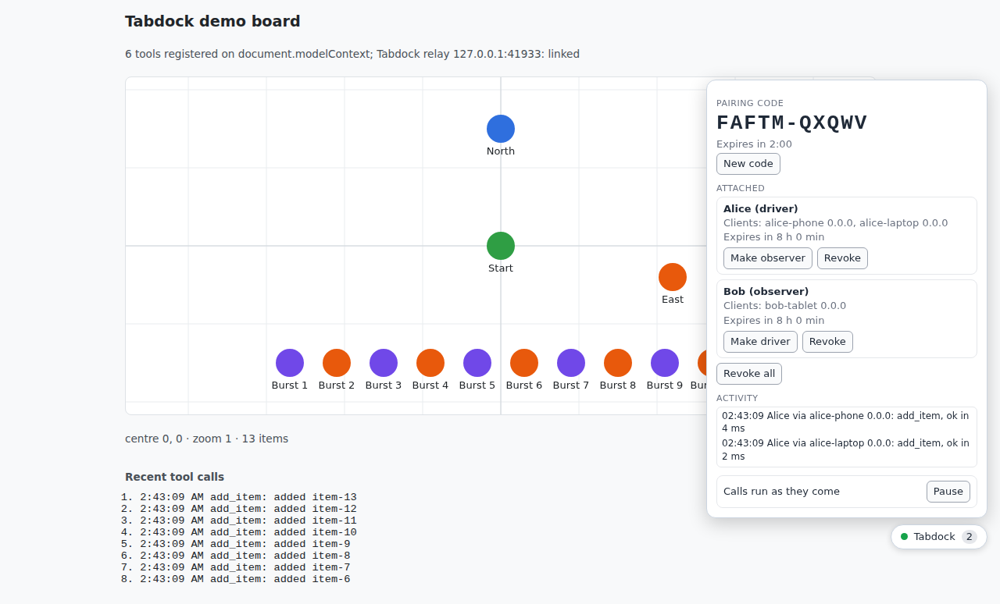
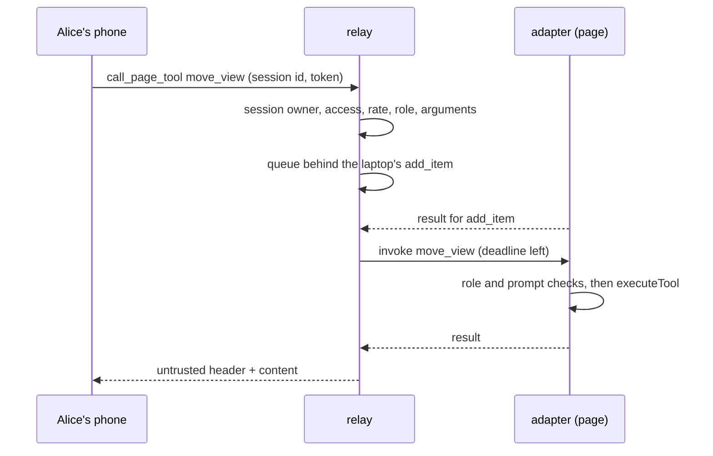

# 02: Many clients, many users

M2 lets several people, each with several MCP clients, share one tab. The operator sees who is attached through which clients, changes roles, revokes, pauses and watches every call, while the relay runs changes to the page one at a time and keeps any one client or page from hogging it.

## What exists now

`relay.ts` now splits `/mcp`: 2025-era clients go to `sessions.ts`, one SDK transport per session bound to its user (another user presenting the id gets 404; ADR 0009), while 2026-07-28 clients such as Claude Code stay stateless. Either way `mcp.ts` names the client. `hub.ts` gains a write queue per page, the section 9 limits and 8-hour idle expiry; arguments are checked on a worker thread (`argument-worker.ts`, ADRs 0008 and 0010). In `packages/adapter`, the `Dock` gains `setRole`, `revoke` and `pause`, `core.ts` runs writes one at a time and keeps the last 50 calls, and `widget.ts` adds roster rows with a role switch and Revoke, Revoke all, the activity list and Pause. One approval covers one page and its reloads (ADR 0011).

## One write, traced

Alice's laptop is adding an item when her phone asks to move the view.

The phone, a 2025-era client, sends Alice's token and its `Mcp-Session-Id`; `McpSessions.handle` checks the session is hers before the SDK sees it. `#call` in `hub.ts` checks that she is attached and not expired (`#access`), under her call limit, that the tool exists and an observer is not asking for a write (S5), and that the queue has room. `move_view` is not read-only, so it takes its place in the page's queue at once (the relay logs `call queued` at debug level, as `pnpm demo:m2` shows) while `#checkArguments` checks the arguments on the worker (about 100 ms at most, `invalid_arguments` otherwise). When the laptop's call ends, `#pump` takes the next one and `#dispatch` checks access and role again, since either may have changed, then sends the `invoke` with what is left of its deadline.

On the page, `onInvoke` in `core.ts` logs a running entry; `admit` and `runWrite` apply the least of grant, roster and claimed role through `check`, `pump` keeps writes to one at a time, `proceed` handles any consequential prompt (checking the role again after it), and `execute` runs the tool. The entry settles as `ok` and the result travels back as in M1.

Had the operator clicked Revoke on Alice's row, `Dock.revoke` would drop her grant and send `revoke`, and `#revoke` in `hub.ts` would cancel her running call, empty her queued ones and answer each `not_attached` (S8).

## Try it by hand

1. Put two users in `.env` (`TABDOCK_DEV_TOKENS=alice=...,bob=...`), run `pnpm dev`, and add the relay to Claude Code with Alice's token as `pnpm dev` prints. In a second folder, add it again with Bob's token and start a second Claude Code there. Pair both, allow Alice as driver and Bob as observer, and watch the roster name both clients. Ask Bob's Claude to add an item: `role_denied`.
2. Ask Alice's Claude to add five items quickly, and watch the activity list run them one by one. Click Revoke on Alice's row mid-way: the rest end `not_attached`. Click Pause and ask Bob's Claude for the view: `page_busy` until you click Resume.
3. Run `pnpm demo:m2` to see two users, three clients, a burst of queued writes, a revoke and a denied `clear_board` narrated, ending with the page's activity log and the relay's audit. `packages/relay/README.md` lists the `TABDOCK_*` variables for the limits.
