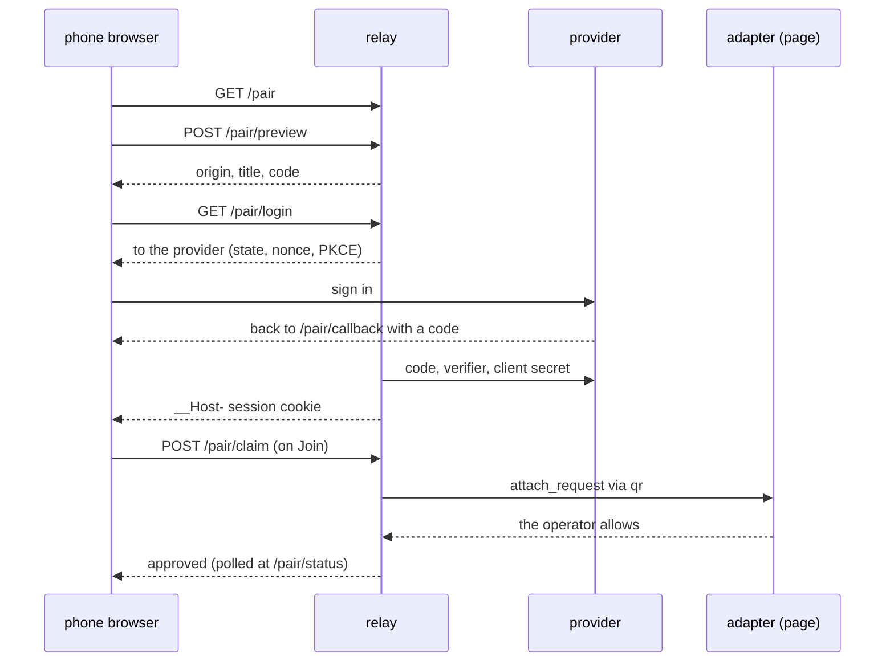

# 03: The phone

M3 puts the relay behind a public https address so Claude on a phone can reach a page on the laptop. The relay becomes an OAuth resource server: an identity provider (WorkOS AuthKit for the owner, a mock in tests) signs people in, and the relay only checks the tokens it issues (ADR 0013). A phone joins by typing the code or by scanning the widget's QR code.

## What exists now

`TABDOCK_PUBLIC_URL` switches on public URL mode (`config.ts`, ADR 0014): the tunnel's host joins the Host allowlist, dev tokens stop working, and `/page` still takes only sockets made on the laptop (`madeLocally` in `relay.ts`). `oauth.ts` checks the provider's metadata at startup, serves the protected resource metadata and verifies each token; `auth.ts` says what any auth plugin returns. `pair.ts` and `pair-page/` serve the QR flow, and the adapter's `qr.ts` draws the code. `spike.ts`, behind `TABDOCK_SPIKE`, times calls and pairings for `docs/notes/spike.md`.

## One phone, traced

The widget shows `<public URL>/pair#<nonce>`. `#issuePairNonce` in `hub.ts` draws 128 bits beside each code, keeps only a digest in the single-use store (`store.ts`), and lets both die together. The phone opens `/pair`; `pair.js` moves the nonce from the address bar into `sessionStorage` and asks for a preview, which spends nothing, so the person can match the code on the phone against the widget. Sign-in runs through `login` and `callback` in `pair.ts` with `openid-client`, the relay acting as a confidential client: the callback checks state, nonce and PKCE, maps the ID token's `sub` through `TABDOCK_OAUTH_USERS` (`accountOf` in `oauth.ts`) and sets the `__Host-` cookie. Only a tap on Join posts the claim, which checks the origin, the session and membership before it reads the nonce. `claimPairNonce` then spends it, `#startPairing` rotates the page's code and nonce and raises the usual attach prompt, and the phone polls for the answer.

Claude on the phone signs in the first time it reaches `/mcp`. `handleMcp` in `relay.ts` asks `authenticate` in `oauth.ts`, which answers a missing token with a 401 whose `WWW-Authenticate` points at `/.well-known/oauth-protected-resource/mcp`. Claude reads that document, signs in at the provider with PKCE and `resource` set to the connector URL, and tries again. `verifyBearerToken` checks the new token with `jose` (RS256, issuer, audience equal to the connector URL, expiry); a `sub` not on the list gets a 403, which Claude treats as final, and unreachable provider keys a 503. From there the phone's calls run exactly as in M2, attributed to the signed-in user.

## Try it by hand

1. Run `pnpm demo:m3`: sign-in against a mock provider, pairing by code and then by the QR code from a phone-sized browser, with the scan-to-first-call timings, all on this machine.
2. Run `pnpm dev:public` with nothing set: it names every missing setting. Fill `.env` as `docs/checklists/M3.md` says, run it again, and enter the values it prints at the provider and in Claude.
3. With `pnpm dev:public` running behind the tunnel, `curl -i -X POST <public URL>/mcp` shows the 401 and its `resource_metadata`; open that URL to read the document Claude reads, then scan the widget's QR code with your phone's camera.
