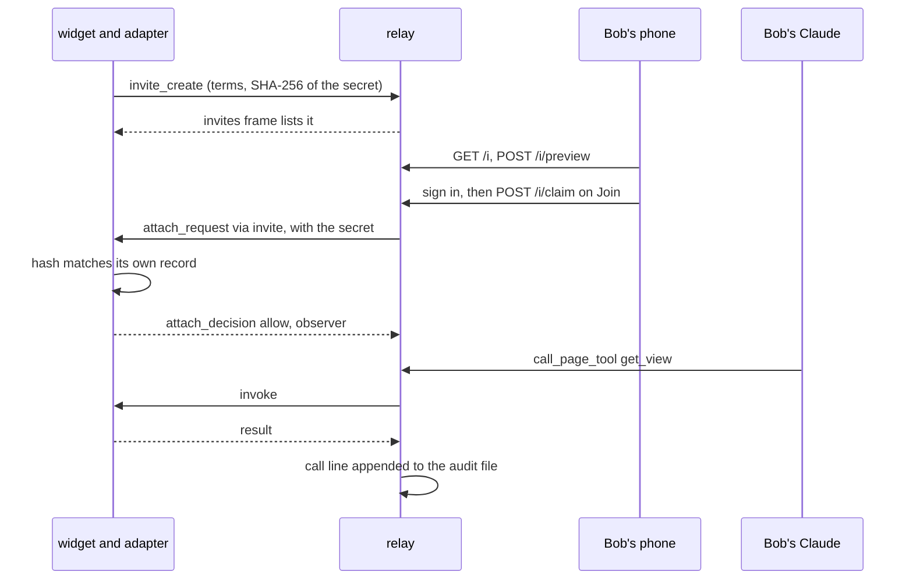

# 04: Local and hosted

On a clean clone with no `.env`, `pnpm relay` now starts in local mode (ADR 0022): loopback only, one user called `you`, and a banner with a `claude mcp add` line for Claude Code. With settings, the same relay runs at a stable public URL on a host, where Claude on the web and the phone signs in, and an operator can share a page by invite with someone outside the user list.

## What exists now

`config.ts` picks local mode when no auth setting is set outside production. `loadOwnerToken` in `local-token.ts` draws a 256-bit token into a 0600 `owner-token` file outside the repo, and refuses, never repairs, a file another account owns or can read. The dev-token plugin holding it is marked `loopbackOnly`, `madeLocally` in `relay.ts` turns away proxied requests, and `local-banner.ts` prints a line that reads the file, so the token never reaches the screen. Hosted mode adds `client-address.ts` and per-address limits (ADR 0018); `audit-file.ts` keeps a hash-chained log on disk in either mode (ADR 0019); `docs/deploy.md` describes one reference deployment and `docs/threat-model.md` its risks. Invites (ADR 0017) need a public URL and `TABDOCK_INVITES`.

## One watch invite, traced

Alice is attached as a member; the operator shares the board with Bob.

The operator types a label in the widget's Invite form, keeps Can watch and clicks Create link (`createInvite` in `widget.ts`). `invite` in `core.ts` draws a 128-bit secret, keeps only its SHA-256 in the page's own record and sends `invite_create`. `#inviteCreate` in `hub.ts` checks policy, the public URL and a sponsor (the longest-attached member, Alice), stores an `InviteRecord` holding only `secretHash` (`InviteStore` in `store.ts`) and lists it back. Only then does the widget show `<public URL>/i#<secret>`, once.

Bob opens it. `pair-page/invite.js` moves the secret from the fragment into `sessionStorage`, and `invitePreview` in `pair.ts` shows the page and who shared it, using nothing up. He signs in through `/pair/login?to=i` and, not being on the user list, becomes an invitee: `g_` plus a digest of his subject, named by his verified email. Join posts `/i/claim`; `#redeem` in `hub.ts` finds the invite by digest, counts the attempt per user, invite and page, and sends the page an `attach_request` carrying the secret, which the relay never stores.

`checkRedemption` in `core.ts` hashes that secret against the page's own record, so a relay that never saw the link cannot forge a join, and `redemptionProblem` checks expiry, uses, revokes and policy. A watch invite needs no prompt: `decide` grants observer, capped at the invite's role and ending in 24 hours, and the widget shows a join notice. `#approveRedemption` in `hub.ts` makes the attachment and writes `attach` and `invite_redeemed` records.

Bob's Claude, signed in as the same account, calls `call_page_tool` with `get_view`. `#call` lets an observer read, the page's `pageRole` applies the cap again, and `#audit` appends a `call` line with outcome `ok`, a `seq` and `prev` (the previous line's hash) in `TABDOCK_AUDIT_DIR`. An `add_item` from Bob ends `role_denied`.

## Try it by hand

1. On a clean clone with no `.env`, run `pnpm relay`, paste the line it prints, and check with `claude mcp list` that `tabdock-local` is connected. Never use `claude mcp get`, which prints the token.
2. Run `pnpm demo:m4`: local mode, then a watch invite, a control invite on `?invites=all`, Revoke all and `pnpm audit:log --verify`, every printed line checked for secrets.
3. Stop the relay, delete `owner-token` and start again: `claude mcp list` shows the old entry failing with 401. Run `claude mcp remove --scope user tabdock-local` and paste the new line. `pnpm audit:log` then reads local mode's log beside the token.
