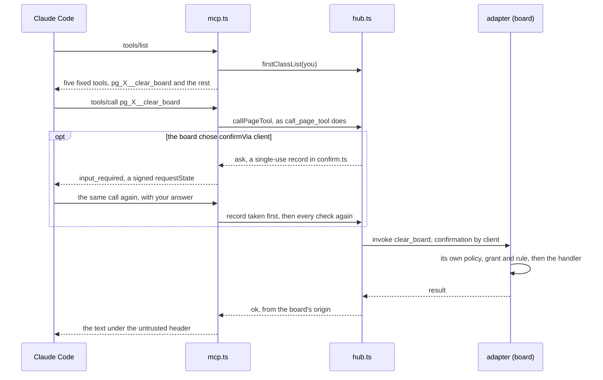

# 05: First-class tools

M5 lets a page's tools stand beside the client's own. With `TABDOCK_FIRST_CLASS_TOOLS=1`, off by default in every mode (ADR 0025), a member's `tools/list` adds `<page id>__<tool>` for each page they hold other than by invite, all of a driver's tools and an observer's read-only ones; invitees keep the five fixed tools. A page with `policy.confirmVia: 'client'` lets a member driver confirm a consequential call in their own client (ADR 0026). The relay serves 2025-03-26 to 2026-07-28, checked by a client matrix, the official conformance suite and Claude Code, and refuses a foreign `Origin` on `/mcp` (ADR 0027). `npx @tabdock/relay` starts local mode once the owner publishes 0.1.0 (ADR 0028), and `apps/site` builds the demo and this tour for Pages, each diagram drawn at build time (ADR 0029).

## One call, traced

The board runs with `?confirm=client`, Claude Code is attached as a driver, and you ask it to clear the board.

The relay's tool surface now runs on the SDK's low-level `Server` (`createMcpFactory` in `packages/relay/src/mcp.ts`), since names a page chooses cannot be registered one by one; its `tools/list` handler adds `hub.firstClassList(userId)` to the fixed entries. Each entry was built once, as the page's tools frame arrived (`firstClassEntry` in `first-class.ts`): a relay prefix calling the page's text untrusted, the cut schema, and `call_page_tool`'s annotations whatever the page claims.

The `tools/call` handler spends one request, `parseFirstClassName` splits the name, and `callPage` hands `{ firstClass: 'clear_board', calledAs }` to `hub.callPageTool`, the function `call_page_tool` reaches. `#call` in `hub.ts` runs the same checks (access, rate limit, byte charge, `#resolveTool`, the observer rule, the frame's size), `#proceed` queues and checks the arguments, and `#sendInvoke` writes the invoke. The adapter's `onInvoke` (`packages/adapter/src/core.ts`) checks again and runs the handler, `#result` settles the call, and `callResult` in `mcp.ts` heads the page's text with `[tabdock: untrusted content from <origin>, tool clear_board]`. One audit line names the page tool either way.

## The confirmation

`asksClient` in `packages/relay/src/confirm.ts` asks the client only when the page chose `confirmVia: 'client'` under `consequential: 'confirm'`, the adapter marked the tool `consequential: true`, and the caller is a member driver, on an attachment no invite made, whose client declared form elicitation. On 2026-07-28 the hub keeps a single-use record (user, page, name as called, page tool, SHA-256 of the canonical arguments, 120 s) and `askInClient` answers `input_required`, its `requestState` signed by the SDK's codec and holding only the record's id; on the retry, `takeRetry` takes the record before any other check and `#retried` compares it. A 2025-era session gets `elicitInput` inside the request. Decline, cancel, expiry, reuse and changed arguments answer `not_confirmed`, and the page never hears of the call. The adapter's `takesClientConfirmation` honours the invoke's `confirmation` only under its own policy, its own grant for the caller and its own consequential rule; anything else prompts as before.

## Try it by hand

1. Run `pnpm demo:m5`: local mode with the flag on, an SDK client on each revision listing and calling a first-class tool, then confirming a consequential call through its elicitation handler.
2. Start `TABDOCK_FIRST_CLASS_TOOLS=1 pnpm relay` (or `npx @tabdock/relay` with the same setting, once published), paste its `claude mcp add-json` line, run `pnpm dev:demo`, open `http://127.0.0.1:5173/?relay=ws://127.0.0.1:8787/page`, click Connect, pair from Claude Code and allow it on the board. `/mcp` then lists `<page id>__add_item` beside `call_page_tool`.
3. Add `&confirm=client`, reconnect and ask Claude Code to clear the board: it asks you, the board runs the call without its prompt, and the activity log reads `confirmed in "claude-code <version>" by You`. Decline once to see `not_confirmed`.
